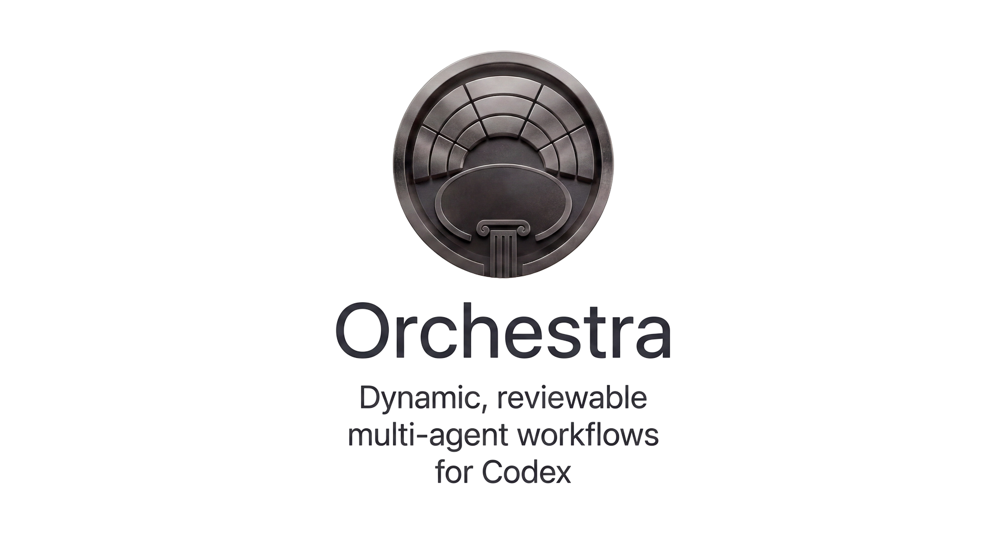
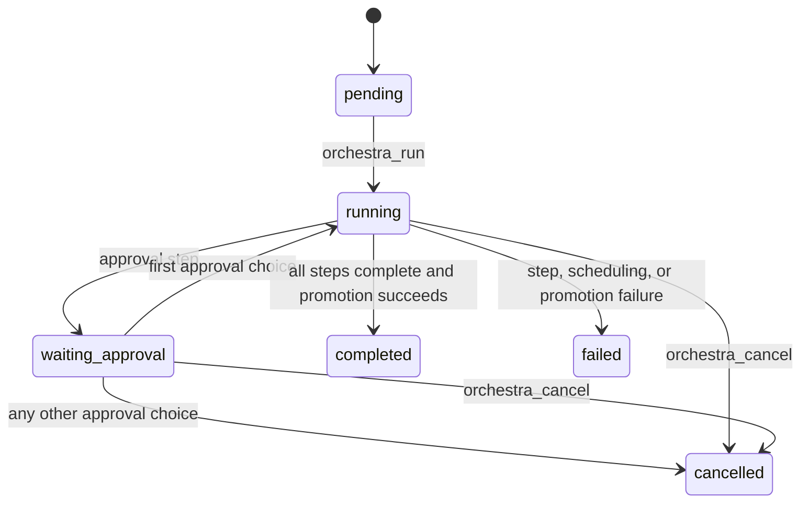

<div align="center">
  <picture>
    <source media="(prefers-color-scheme: dark)" srcset="assets/dark-logo.png">
    <source media="(prefers-color-scheme: light)" srcset="assets/light-logo.png">
    
  </picture>
</div>

Orchestra is a workflow runtime for composing task-specific Codex agents, checks, approvals, retries, and parallel stages. A workflow declares the work; a Rust runtime validates the plan, schedules it through the active Codex task, and persists enough state to inspect or resume the run.

1. Write a restricted `.workflow.ts` file.
2. Validate and run it through Orchestra's native Codex tools.
3. Inspect validated outputs, check evidence, approvals, and the run summary in the target repository.

Orchestra is useful when a task needs more structure than a single prompt: parallel investigation, explicit implementation and verification stages, bounded retries, human approval, or recovery after interruption. Agents remain native Codex child tasks; Orchestra does not introduce a daemon, MCP server, external scheduler, or separate agent service.

> [!IMPORTANT]
> Orchestra is experimental and source-first. The authoring skills can load on stock Codex, but the five native workflow tools require the Codex revision pinned in [`integration/codex/UPSTREAM_REVISION`](integration/codex/UPSTREAM_REVISION) with Orchestra's integration patch. The repository does not yet provide a complete end-user installer for that custom App Server build.

## Prerequisites

Required for development and automated verification:

- Git;
- a current Rust toolchain with Cargo;
- the native build dependencies required by the pinned Codex source;
- a Codex CLI on `PATH` for lifecycle capability checks;
- a clean directory in which the integration script can clone Codex.

A provider-backed workflow run also requires:

- a Codex client connected to the Orchestra-enabled App Server build;
- normal Codex provider authentication;
- access to every model named by the workflow.

There are no interchangeable Orchestra backends today. The only production adapter is the native Codex host backed by the active task's V2 `AgentControl`.

| Environment | Author workflows | Run workflows | Notes |
| --- | --- | --- | --- |
| Orchestra-enabled pinned Codex build | Yes | Yes | Required native host |
| Stock Codex with the plugin skills | Yes | No | Cannot register Orchestra's Rust tools |
| SDK threads, `codex exec`, MCP, daemon, or sidecar | No | No | Deliberately unsupported as alternate runtimes |

## Quick start

### 1. Verify the runtime and pinned integration

From this repository:

```bash
cargo test --workspace
cargo run -p codex-orchestra-lifecycle -- doctor
scripts/codex-integration.sh /tmp/codex-orchestra-codex verify
```

The integration script clones the pinned Codex revision when necessary, applies the patch and Rust overlay, tests the Orchestra core and adapter, and checks `codex-app-server`. A successful run ends with the pinned revision reported as verified.

This is the shortest fully automated path supported by the repository. The script prepares and verifies the patched App Server source; connecting that build to a Codex client still depends on the client's development setup and has not yet been packaged as an Orchestra install command.

### 2. Configure a target repository

Preview project-local configuration before applying it:

```bash
cargo run -p codex-orchestra-lifecycle -- project --target /path/to/repository
cargo run -p codex-orchestra-lifecycle -- project --target /path/to/repository --apply
```

This installs `.codex/config.toml`, records managed-file hashes under `.codex/orchestra/`, and creates `.codex/orchestra/runs/`. It does not install or replace Codex.

### 3. Add a minimal workflow

Create `inspect.workflow.ts` in the target repository:

```ts
import { agent, check, pipeline, workflow } from "@codex-orchestra/workflow";

export default workflow({
  name: "inspect-project",
  steps: [
    pipeline([
      agent({
        id: "inspect",
        prompt: "Summarize this project for a new contributor.",
        model: "gpt-5.4",
        context: [{ type: "file", path: "README.md" }],
        outputs: ["summary"],
      }),
      check({
        id: "check-diff",
        command: ["git", "diff", "--check"],
      }),
    ]),
  ],
});
```

The package in [`sdk/`](sdk/) supplies editor types only. Rust parses the file directly; Node.js does not execute it.

### 4. Validate and run it

In an active task backed by the Orchestra-enabled build, ask Codex:

```text
Validate and run inspect.workflow.ts with Orchestra. Report the run id and summary.
```

The task should call `orchestra_validate` before `orchestra_run`. On success, resolved inputs are written to `inputs.json`, the `inspect` output is written to `.codex/orchestra/runs/<run-id>/outputs/inspect.json`, check evidence is recorded under `evidence/checks/`, and `summary.md` records the terminal state.

## Define a workflow

Workflow source is a restricted TypeScript-shaped data language. It accepts one Orchestra import, literal values, arrays, objects, static template strings, and approved DSL calls. Functions, methods, dynamic imports, arbitrary identifiers, environment access, process or filesystem APIs, `eval`, and trailing statements are rejected.

The main calls are:

| Call | Purpose |
| --- | --- |
| `workflow({...})` | Define the top-level workflow; `defineWorkflow` is an alias |
| `agent({...})` | Spawn one native Codex child task and validate its JSON response |
| `check({...})` | Run an argv-style command through Codex's sandbox executor |
| `approval({...})` | Pause until the caller supplies a human decision on resume |
| `pipeline([...])` | Make each group depend on the preceding group |
| `parallel([...])` | Place steps together without adding dependencies |
| `worktree(step, policy)` | Select `"shared"` or `"isolated"` workspace behavior |
| `repeat(step, policy)` | Repeat a step until an output equals a target value |

Use [`assets/templates/WORKFLOW.workflow.ts`](assets/templates/WORKFLOW.workflow.ts) as the small starter and [`evals/workflows/native-vertical-slice.workflow.ts`](evals/workflows/native-vertical-slice.workflow.ts) as the broader executable fixture.

### Agents

Use an agent step for work that needs model reasoning. Every agent names its model explicitly. By default it receives no parent transcript, no declared context, and no authority to delegate further.

```ts
agent({
  id: "review",
  prompt: "Review the change for correctness.",
  model: "gpt-5.4",
  reasoning_effort: "high",
  fork_turns: "none",
  context: [{ type: "diff", from: "HEAD~1", to: "HEAD" }],
  outputs: ["findings"],
});
```

Orchestra appends the context digest, materialized context, delegation rule, and JSON output contract to the prompt. Completion alone does not complete the step: the final response must be a JSON object containing every declared output key. Invalid output consumes an attempt.

### Checks

Use a check for deterministic verification. Commands are argv arrays, not shell strings.

```ts
check({
  id: "tests",
  command: ["cargo", "test", "--workspace"],
  cwd: "crates/orchestra-core",
  timeout_ms: 300000,
  max_attempts: 2,
});
```

Exit code `0` produces `{ "passed": true }`. Any other exit code produces `{ "passed": false }`, records stdout and stderr as evidence, and retries while the attempt budget remains. `cwd` is joined to the step workspace; the current implementation does not reject `..` segments, so workflow files must be trusted.

### Approvals

An approval is a durable pause, not a model decision:

```ts
approval({
  id: "accept",
  prompt: "Accept the verified result?",
  choices: ["accept", "reject"],
});
```

The native adapter currently returns the pause to the caller. Resume the run with an explicit `approval_decision` only after the user decides. The decision must exactly match a unique, nonempty declared choice. The first choice continues the run; every other choice rejects the result and cancels the run without promotion.

### Pipelines, parallel steps, and dependencies

`pipeline` adds dependencies between adjacent entries. `parallel` adds none:

```ts
pipeline([
  agent({ id: "plan", prompt: "Plan the change.", model: "gpt-5.4" }),
  parallel([
    agent({ id: "inspect-code", prompt: "Inspect the code.", model: "gpt-5.4" }),
    agent({ id: "inspect-tests", prompt: "Inspect the tests.", model: "gpt-5.4" }),
  ]),
  check({ id: "verify", command: ["cargo", "test", "--workspace"] }),
]);
```

This lowers to `inspect-code` and `inspect-tests` depending on `plan`, with `verify` depending on both inspectors. Use `needs` directly when the graph is not naturally expressed as nested pipelines.

At runtime, Orchestra selects dependency-ready steps in plan order and starts up to `max_parallel` of them in one stage. A failed step fails the run; dependent steps do not start.

### Worktrees and write scopes

Steps default to a shared detached worktree for the run. Wrap a step with `worktree(..., "isolated")` when it must have its own detached worktree:

```ts
worktree(
  agent({
    id: "implement",
    prompt: "Implement the approved change.",
    model: "gpt-5.4",
    write_scope: ["crates/orchestra-core/"],
    outputs: ["complete"],
  }),
  "isolated",
);
```

Concurrent writers with overlapping path prefixes fail validation unless both use isolated worktrees. For isolated agent steps, Orchestra also rejects a completed change set containing paths outside the declared `write_scope`. This is a runtime validation boundary, not an operating-system write restriction while the agent is running.

Isolated changes are captured as durable patches, integrated serially into the shared run worktree, and verified there before approval. Once the run completes with the first approval choice, Orchestra persists an aggregate `promoted.patch`, checks that it applies cleanly, and applies it to the target checkout without staging it. A conflict fails promotion without changing target files and retains the shared worktree so `orchestra_resume` can retry. Rejection cleans up without promotion.

An unborn repository can use the shared checkout directly. Isolated worktrees require a committed source revision.

### Attempts and repeats

`max_attempts` retries a failed execution of the same step. `repeat` starts additional rounds after successful executions until an output reaches the requested value:

```ts
repeat(
  agent({
    id: "repair",
    prompt: "Repair the remaining failures.",
    model: "gpt-5.4",
    max_attempts: 2,
    outputs: ["complete"],
  }),
  {
    max_rounds: 3,
    until_output: "complete",
    equals: true,
    stop_on_no_progress: true,
  },
);
```

Attempts are bounded from 1 to 10. Repeat rounds are bounded from 1 to 20. A new round resets the attempt counter. With `stop_on_no_progress: true`, identical outputs in consecutive rounds fail the step early.

### Complete workflow example

This example combines the major control-flow primitives. It is a reference map, not the recommended starting point:

```ts
import {
  agent,
  approval,
  check,
  parallel,
  pipeline,
  repeat,
  workflow,
  worktree,
} from "@codex-orchestra/workflow";

export default workflow({
  name: "review-implement-verify",
  description: "Inspect in parallel, implement with bounded repeats, verify, and pause.",
  max_parallel: 2, // Defaults to 4; validation accepts 1 through 32.
  steps: [
    pipeline([
      parallel([
        agent({
          id: "inspect-runtime",
          prompt: "Inspect the runtime and report relevant constraints.",
          model: "gpt-5.4", // Required for every agent.
          reasoning_effort: "high",
          fork_turns: "none", // Default: start without parent transcript history.
          context: [
            { type: "range", path: "CONTEXT.md", start: 1, end: 40 },
            { type: "revision", revision: "HEAD", path: "Cargo.toml" },
          ],
          outputs: ["findings"],
        }),
        agent({
          id: "inspect-change",
          prompt: "Inspect the most recent change and identify test coverage gaps.",
          model: "gpt-5.4-mini",
          reasoning_effort: "medium",
          context: [
            { type: "diff", from: "HEAD~1", to: "HEAD", paths: ["crates/"] },
          ],
          outputs: ["findings"],
        }),
      ]),
      worktree(
        repeat(
          agent({
            id: "implement",
            prompt: "Implement the bounded change using the declared findings.",
            model: "gpt-5.4",
            reasoning_effort: "high",
            max_attempts: 2, // Retries execution failures within each round.
            context: [
              { type: "dependency_output", step: "inspect-runtime", output: "findings" },
              { type: "dependency_output", step: "inspect-change", output: "findings" },
            ],
            outputs: ["complete", "summary"],
            write_scope: ["crates/orchestra-core/"],
            allow_delegation: false,
          }),
          {
            max_rounds: 2,
            until_output: "complete",
            equals: true,
            stop_on_no_progress: true,
          },
        ),
        "isolated",
      ),
      check({
        id: "tests",
        command: ["cargo", "test", "--workspace"],
        timeout_ms: 300000, // Defaults to 120000 ms.
      }),
      approval({
        id: "accept",
        prompt: "Accept the verified result?",
        choices: ["accept", "reject"],
      }),
    ]),
  ],
});
```

`pipeline` supplies the dependencies in this example. The implementation step receives structured output through context rather than transcript inheritance. The run pauses at `accept` and resumes only when the caller passes a declared decision. `accept`, the first choice, completes the run and promotes the verified patch; `reject` cancels and cleans up without touching the target checkout.

## Shipped workflows and templates

| File | Purpose |
| --- | --- |
| [`assets/templates/WORKFLOW.workflow.ts`](assets/templates/WORKFLOW.workflow.ts) | Small starter with one agent followed by one check |
| [`evals/workflows/native-vertical-slice.workflow.ts`](evals/workflows/native-vertical-slice.workflow.ts) | Parallel inspection, bounded implementation repeat, check, and approval |
| [`assets/templates/INTERACTIVE-VERIFICATION.md`](assets/templates/INTERACTIVE-VERIFICATION.md) | Evidence record for automated and human-only integration checks |

Copy the small workflow template into the target repository, rename it with the `.workflow.ts` suffix, and change its model, context, outputs, commands, and write scope for the task. Validate the result before running it.

## Context and inputs

Agent context is opt-in. `fork_turns` defaults to `"none"`, so declared context normally replaces inherited transcript history.

| Context source | Fields | Resolution |
| --- | --- | --- |
| `file` | `path` | Entire UTF-8 repository file |
| `range` | `path`, `start`, `end` | One-based, inclusive line range |
| `diff` | `from`, `to`, optional `paths` | `git diff --no-ext-diff --binary` between revisions |
| `revision` | `revision`, `path` | File contents from `git show <revision>:<path>` |
| `dependency_output` | `step`, `output` | Pretty-printed JSON from a completed step |
| `input` | `input` | Exact resolved run-input value |

File and range paths are canonicalized and rejected if they escape the repository, including through symlinks. Revision paths must not begin with `-`. A missing dependency output, invalid range, Git failure, non-UTF-8 file, or path escape fails context materialization.

Sources are concatenated between labeled delimiters in declaration order and hashed with SHA-256. The digest is stored in the step checkpoint and included in the agent prompt.

Workflows declare JSON-compatible run inputs at the top level. Each input has a `type` (`string`, `number`, `boolean`, `object`, `array`, or `json`), is required by default, and may declare `required: false` or a `default`. The runtime rejects unknown, missing, or wrongly typed values before creating a run.

The authoring package exports `ref()`. Agent prompts may reference `` `${inputs.ticket}` `` directly, or use `ref("inputs.ticket")` when the whole value is the prompt. String values are inserted verbatim; other JSON values use compact JSON. Input references and `input` context sources are resolved by Rust—the TypeScript source is never executed. Step-output templates such as `` `${steps.plan.outputs.result}` `` remain reserved authoring syntax; use `dependency_output` context for executable step data flow.

### Transcript inheritance

| `fork_turns` | Behavior | Constraint |
| --- | --- | --- |
| `"none"` | Start with fresh history | Default and recommended |
| `{ last: n }` | Inherit the most recent `n` turns | Declared context is still appended |
| `"all"` | Inherit full parent history | Cannot set `reasoning_effort` or `service_tier` |

Every agent still requires an explicit `model`. Recursive delegation defaults to `false` and also depends on the repository's Codex depth configuration.

### Skill requirements

Agent steps declare the complete skill closure they need. Each entry has a `name`, optional `requires`, and optional repository-safe paths in `resources`:

```ts
skills: [
  { name: "implement", requires: ["tdd"] },
  { name: "tdd", resources: ["references/testing.md"] },
]
```

Every named transitive requirement must appear in the same agent step. Cycles, conflicting declarations, duplicate requirements, and absolute or escaping resource paths fail workflow validation. The native Codex host resolves plain names only when they identify one enabled skill; qualified plugin identities disambiguate duplicates.

Before creating the run, Orchestra snapshots the exact `SKILL.md`, declared resource bytes, canonical identity, source locator, plugin identity, and native tool-dependency metadata. Agent prompts receive the recorded instructions and paths to recorded resources. Resume verifies and uses this evidence without reloading the installed skill, so ambient edits cannot change an in-progress run.

## Outputs and validation

An agent must return exactly one JSON object. When `outputs` is nonempty, Orchestra extracts those named keys and rejects a response that omits any of them. When `outputs` is empty, every property in the returned object becomes a step output.

Validated outputs are available to later steps through `dependency_output` and are written to:

```text
.codex/orchestra/runs/<run-id>/outputs/<step-id>.json
```

Checks always expose a `passed` boolean. Approval decisions are stored separately under `approvals/` rather than as ordinary step outputs.

Malformed JSON, a non-object response, missing keys, agent failure, command failure, or a native-host error consumes an attempt. Orchestra retries until `max_attempts` is exhausted, then marks the step and run failed.

## Run lifecycle



The Rust runtime owns every transition:

1. Compile and validate workflow source.
2. Snapshot the execution plan and source revision.
3. Select dependency-ready steps up to `max_parallel`.
4. Materialize context and create the requested worktree.
5. Spawn agents or run checks through the native host.
6. Validate outputs and atomically save state after transitions.
7. Pause for approvals or retry within bounds.
8. Promote the aggregate verified patch after acceptance, clean up, and write the terminal summary.

### Resume, cancellation, and cleanup

`orchestra_resume` reopens `workflow.json`, `inputs.json`, and `state.json`; it does not depend on the parent transcript. It verifies the resolved-input digest before doing any work. Callers may resupply `inputs`; changed values are rejected. Completed and cancelled runs return their existing terminal outcome. Interrupted running steps return to pending if attempt budget remains, or fail if interruption exhausted that budget.

A failed run is eligible for resume, but already failed steps remain failed in the current implementation, so resume does not repair or rerun them automatically.

`orchestra_cancel` asks active native child tasks to cancel, marks active or waiting steps cancelled, saves a summary, and removes the shared worktree. Cancelling a completed, failed, or already cancelled run is idempotent and returns its current checkpoint.

Isolated worktrees are removed after their step finishes. The shared worktree remains while a run is waiting for approval and is removed after completion, rejection, ordinary failure, or cancellation. A promotion conflict retains it for retry. Cleanup errors fail the run instead of being ignored.

## Run artifacts

All mutable runtime state belongs to the target repository:

```text
.codex/orchestra/runs/<run-id>/
├── workflow.json                   compiled execution plan
├── inputs.json                     immutable resolved run inputs
├── state.json                      atomic run checkpoint
├── outputs/<step-id>.json          validated step outputs
├── evidence/checks/<step>-<n>.json command, timeout, exit code, stdout, stderr
├── evidence/skills/manifest.json   resolved identities, artifact paths, and digests
├── evidence/skills/<skill>/        exact SKILL.md and declared resource bytes
├── evidence/changes/<step>-<n>.patch isolated attempt patches
├── evidence/changes/promoted.patch aggregate verified promotion patch
├── approvals/<step-id>.json        explicit approval decision
└── summary.md                      paused or terminal summary
```

The checkpoint records the workflow, input, and skill-manifest hashes, resolved inputs and skill identities, parent task, repository, source revision, run and promotion status, per-step attempts and rounds, context hashes, outputs, errors, agent handles, and next action. Files are written through temporary files and atomic rename.

Installed plugin files and the custom runtime contain no mutable run state. Uninstall preserves `.codex/orchestra/runs/`.

## Workflow reference

### Workflow options

| Field | Type | Required | Default | Notes |
| --- | --- | --- | --- | --- |
| `name` | `string` | Yes | — | Must not be blank |
| `description` | `string` | No | `""` | Stored in the compiled plan |
| `inputs` | `Record<string, InputDefinition>` | No | `{}` | Typed JSON-compatible inputs resolved before the run starts |
| `max_parallel` | `number` | No | `4` | Integer from 1 through 32 |
| `steps` | `StepNode[]` | Yes | — | DSL step calls and wrappers |

### Common step options

| Field | Type | Required | Default | Notes |
| --- | --- | --- | --- | --- |
| `id` | `string` | Yes | — | Unique; lowercase letters, digits, `_`, and `-` only |
| `needs` | `string[]` | No | `[]` | Referenced steps must exist; cycles are rejected |
| `max_attempts` | `number` | No | `1` | Integer from 1 through 10 |
| `write_scope` | `string[]` | No | `[]` | Prefix-based conflict declaration |

### Agent options

| Field | Type | Required | Default |
| --- | --- | --- | --- |
| `prompt` | `string` | Yes | — |
| `model` | `string` | Yes | — |
| `reasoning_effort` | `"none" \| "minimal" \| "low" \| "medium" \| "high" \| "xhigh"` | No | inherited/unspecified |
| `service_tier` | `string` | No | inherited/unspecified |
| `fork_turns` | `"none" \| "all" \| { last: number }` | No | `"none"` |
| `context` | `ContextSource[]` | No | `[]` |
| `skills` | `SkillRequirement[]` | No | `[]` |
| `outputs` | `string[]` | No | `[]` |
| `allow_delegation` | `boolean` | No | `false` |

### Check options

| Field | Type | Required | Default | Notes |
| --- | --- | --- | --- | --- |
| `command` | `string[]` | Yes | — | Must contain at least one argv element |
| `cwd` | `string` | No | step workspace | Joined to the workspace path |
| `timeout_ms` | `number` | No | `120000` | Passed to Codex's sandbox executor |

### Approval options

| Field | Type | Required | Default |
| --- | --- | --- | --- |
| `prompt` | `string` | Yes | — |
| `choices` | `string[]` | Yes | — | Unique, nonempty values; the first continues and the rest reject |

### Repeat policy

| Field | Type | Required | Default | Notes |
| --- | --- | --- | --- | --- |
| `max_rounds` | `number` | Yes | — | Integer from 1 through 20 |
| `until_output` | `string` | Yes | — | Output key to compare |
| `equals` | JSON value | No | `null` | Expected value |
| `stop_on_no_progress` | `boolean` | No | `true` | Fail when consecutive outputs are identical |

Unknown fields are rejected after lowering to the Rust plan.

## Native tool reference

All paths are resolved against the active Codex task's repository.

| Tool | Required input | Optional input | Result |
| --- | --- | --- | --- |
| `orchestra_validate` | `workflow_path` | — | `{ valid: true, plan }` or a compile/validation error |
| `orchestra_run` | `workflow_path` | `inputs` | Completed, paused, failed, or cancelled run outcome with checkpoint |
| `orchestra_resume` | `run_id` | `approval_decision`, `inputs` | Run outcome after checkpoint and input reconciliation |
| `orchestra_status` | `run_id` | — | Current `RunCheckpoint` |
| `orchestra_cancel` | `run_id` | — | Updated `RunCheckpoint` |

`workflow_path` must be repository-relative, must end in `.workflow.ts`, and must not escape the repository. `run_id` names a directory directly under `.codex/orchestra/runs/`.

Run states are `pending`, `running`, `waiting_approval`, `completed`, `failed`, and `cancelled`. Step states add `retrying`, although the current executor normally returns retryable work to `pending`.

## Configuration

Orchestra keeps workflow behavior separate from Codex activation settings. Workflows choose models and reasoning per agent step; configuration enables multi-agent support and bounds the task tree.

| Mode | Target | Selection | Command |
| --- | --- | --- | --- |
| Project | `<repo>/.codex/config.toml` | Automatic in the trusted repository | `project --target <repo>` |
| Named profile | `$CODEX_HOME/orchestra.config.toml` | `codex --profile orchestra` | `profile [--codex-home <home>]` |
| Global default | `$CODEX_HOME/config.toml` | Automatic for that Codex home | `global-default [--codex-home <home>]` |

The supplied configuration enables `multi_agent`, sets `max_threads = 6`, and sets `max_depth = 1`. Global-default installation is deliberately separate because it changes the user's default Codex behavior.

Every mutation command previews by default. Add `--apply` only after reviewing its actions. Existing or locally modified files produce a conflict instead of being overwritten.

## Lifecycle CLI

Run the CLI from the source checkout:

```bash
cargo run -p codex-orchestra-lifecycle -- <command>
```

| Command | Purpose | Required options | Behavior |
| --- | --- | --- | --- |
| `doctor` | Validate plugin layout, config, revision pin, skills, and installed Codex capabilities | — | Read-only; exits nonzero on failed checks |
| `project` | Install project-local configuration | `--target PATH` | Also initializes the run directory |
| `profile` | Install selectable `orchestra` profile | optional `--codex-home PATH` | Defaults to `$HOME/.codex` |
| `global-default` | Install Orchestra config as the Codex default | optional `--codex-home PATH` | Requires explicit command choice |
| `upgrade` | Update files previously managed by Orchestra | `--target PATH` | Saves a recovery snapshot first |
| `rollback` | Restore the latest upgrade snapshot | `--target PATH` | Atomic; refuses locally modified managed files |
| `uninstall` | Remove unchanged managed files | `--target PATH` | Preserves modified files and all run artifacts |

`--apply` is optional for every mutating command. Without it, the CLI prints `CREATE`, `KEEP`, `UPDATE`, `CONFLICT`, `RESTORE`, `REMOVE`, or `PRESERVE` actions and changes nothing.

Project installation state is stored in `.codex/orchestra/install-state.json`. Upgrade recovery files remain under `.codex/orchestra/recovery/`. Named and global configuration use `$CODEX_HOME/orchestra-install-state.json`.

## Extension points

The core runtime is host-independent Rust. `NativeHost` is the boundary for an embedding that can:

- resolve enabled skills and read their instructions/resources through the owning filesystem;
- spawn, inspect, wait for, and cancel an agent;
- execute sandboxed commands;
- create and remove worktrees;
- request approval;
- emit activity and optionally persist outputs elsewhere.

The current Codex implementation is `CodexHost` in [`integration/codex/overlay/codex-rs/ext/orchestra/src/tool.rs`](integration/codex/overlay/codex-rs/ext/orchestra/src/tool.rs). It wraps the active task's V2 `AgentControl`; it does not replace Codex scheduling with another control plane.

Implementations must preserve parent-task lineage, return final agent responses, honor cancellation and command timeouts, provide absolute workspaces, and leave durable run state to `OrchestraRuntime`. See [`crates/orchestra-core/src/host.rs`](crates/orchestra-core/src/host.rs) for the trait and the fake host in the runtime tests for a minimal example.

## Current limitations

- Stock Codex cannot dynamically load the Rust extension; the pinned integration patch is required.
- The repository does not yet automate connecting the custom App Server build to a Codex client.
- Step-output template markers are not expanded at runtime; use `dependency_output` context.
- Interactive UI rendering, provider-backed child completion, approval flow, cancellation, and transcript-free recovery remain recorded as human-only pending checks in [`docs/verification/2026-07-14-interactive-baseline.md`](docs/verification/2026-07-14-interactive-baseline.md).

These constraints are tracked explicitly rather than hidden behind an alternate runtime.

## Development

Run the repository checks after structural changes:

```bash
cargo fmt --all --check
cargo test --workspace
cargo run -p codex-orchestra-lifecycle -- doctor
scripts/codex-integration.sh /tmp/codex-orchestra-codex verify
```

The integration command requires either a new destination or a clean checkout at the exact pinned revision. It applies the patch, copies the current core and adapter sources, tests both Orchestra crates in the Codex workspace, and checks `codex-app-server`.

Before changing architecture or terminology, read [`CONTEXT.md`](CONTEXT.md) and the accepted decisions in [`docs/adr/`](docs/adr/). Repository layout, self-hosting, validation, and lifecycle details live in [`docs/`](docs/).

## License

[MIT](LICENSE)
