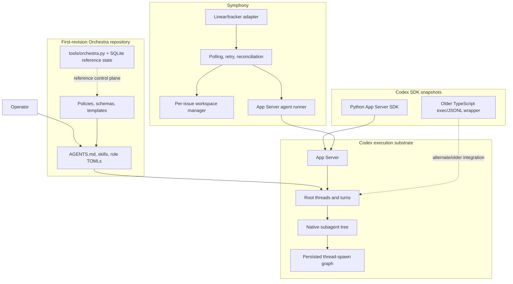
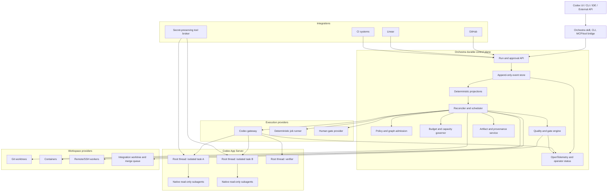
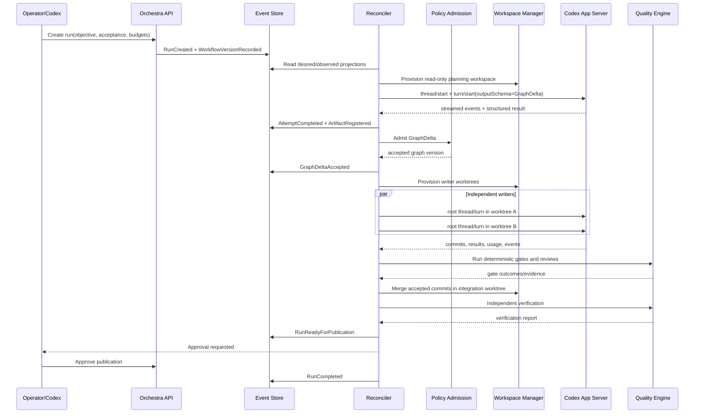
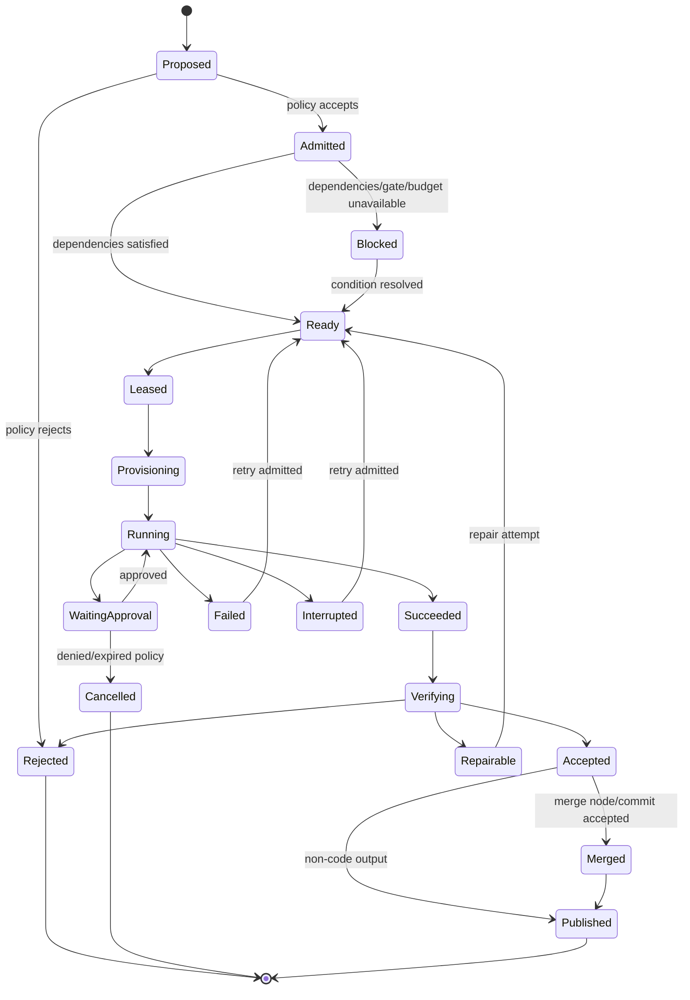

# Codex Orchestra R2 — Current-State Assessment, Research Synthesis, and Next-Revision Design

**Status:** Architecture proposal  
**Date:** 2026-07-14  
**Scope reviewed:** `codex-orchestra-framework`, supplied `codex-rs` snapshot, supplied Codex SDK snapshots, and Symphony  
**Primary recommendation:** Build Orchestra as a durable external control plane around Codex App Server. Treat native Codex subagents as an execution primitive—not as the workflow database or the global organizational model. Reuse Symphony’s outer-loop mechanics selectively rather than embedding Symphony wholesale or forking Codex immediately.

---

## 1. Executive decision

The first revision contains several unusually strong ideas: explicit authority, bounded delegation, leases, write domains, typed handoffs, local joins, recovery rules, and risk-derived verification. Those should survive. The next revision should change the *runtime model* around them.

The decisive architectural split is:

1. **Orchestra owns durable work.** It owns the workflow specification, logical task graph, budgets, policy admission, attempts, approvals, leases, workspaces, artifacts, merge gates, verification, reconciliation, and the canonical event log.
2. **Codex owns agent execution.** It owns threads, turns, model interaction, tools, skills, custom roles, native subagents, thread persistence, streaming events, review sessions, and conversation compaction.
3. **Git and artifact storage own evidence.** Git commits, patches, test reports, review findings, logs, and structured result envelopes are immutable or content-addressed artifacts referenced from the workflow state.
4. **Trackers are adapters, not the database.** Linear, GitHub, or another work source can feed and receive status, but tracker state must not be the only representation of an Orchestra run.

This yields a hybrid topology:

- Independent or write-capable logical tasks run as **separate root Codex threads in separate worktrees or containers**.
- Native Codex subagents are used **inside one task thread** for read-heavy exploration, targeted review, test analysis, or bounded local fan-out.
- The logical workflow is an arbitrary DAG; the native Codex agent tree is a temporary execution topology selected by a scheduler.
- Model-generated workflow changes are proposals. A deterministic admission layer validates them before they become runnable state.

The recommended implementation path is **App Server/Python SDK first**, with a narrow raw JSON-RPC adapter for version-specific or experimental features not yet surfaced by the high-level SDK. Do not begin with a long-lived fork of `codex-rs`. “Fully integrated” should mean first-class use of Codex’s supported thread, turn, event, skill, agent, sandbox, approval, review, hook, and schema surfaces—not copying the Codex harness into Orchestra.

### Bottom-line choices

| Question | Recommendation |
|---|---|
| Integrate Symphony wholesale? | No. Port its workspace, safety, retry, reconciliation, telemetry, and secret-broker patterns. Replace its tracker-centric state model. |
| Keep the fixed 14-role hierarchy as the runtime topology? | No. Keep governance semantics, but reduce runtime roles to a small capability catalog and let the work graph express ownership. |
| Use native subagents as the global scheduler? | No. Use them for context-local fan-out within one Codex task. |
| Use one worktree per native child agent? | Not with the supplied default behavior. Native children inherit the parent execution environment; true writer isolation should be established outside the child tree. |
| Store workflow truth in mailboxes or transcripts? | No. Mailboxes and streamed events are transport. The durable event store and artifacts are truth. |
| Generate executable workflows? | Yes, but compile generated code or structured graph deltas into a restricted Workflow IR. Generated orchestration code must not receive host shell or filesystem access. |
| Fork Codex now? | No. Prove missing API requirements first, then upstream narrowly scoped extensions. |

---

## 2. Scope, method, and validation boundary

### 2.1 Reviewed material

The attachment contains four related bodies of work:

- **`codex-orchestra-framework`**: the first-revision governance and orchestration design, role TOMLs, skills, schemas, policies, and a Python/SQLite reference utility.
- **`codex-rs`**: the supplied Codex Rust source snapshot, including Multi-Agent V2 tool handlers, thread/agent control, App Server, and the persisted agent graph store.
- **`symphony`**: OpenAI’s Symphony specification and Elixir reference implementation.
- **`sdk`**: Python and TypeScript Codex SDK snapshots. The Python snapshot is App Server-oriented and substantially closer to the desired integration boundary.

### 2.2 Executed checks

- `codex-orchestra-framework`: `pytest -q` completed with **18 passing tests**.
- `python tools/orchestra.py doctor`: returned `ok: true`, with no warnings or errors.
- The supplied config was then cross-checked against the supplied Codex source, which revealed that the doctor currently certifies a configuration that the supplied Codex implementation rejects.

### 2.3 Checks that could not be executed in this environment

The container has no `codex`, Rust toolchain, Elixir, or Mix executable. Therefore:

- The actual installed Codex runtime could not be started.
- App Server schemas could not be generated from a live binary.
- Codex Rust tests could not be built or run.
- Symphony’s Elixir tests could not be run.

The source-level findings are high-confidence, but protocol compatibility and end-to-end behavior must be verified against the target Codex binary before implementation is considered production-ready.

### 2.4 Important version boundary

The supplied Codex source and SDK snapshots represent a specific development point. Current public Codex documentation now exposes stable subagent settings under `[agents]`, while the supplied source still contains a transitional Multi-Agent V2 configuration conflict. R2 must therefore discover capabilities at runtime and avoid treating a checked-in feature block as universal.

---

## 3. Clean model of the current pieces and how they relate

### 3.1 Current relationship map



### 3.2 What each component actually is

#### First-revision Orchestra

It is primarily a **governance specification and repository-native operating contract**, plus a tested reference state utility. It is not yet a production scheduler. Its key runtime assumption is that a bounded physical hierarchy of Codex V2 agents can embody operational ownership and route completion to the closest competent parent.

#### Supplied Codex source

It is the **execution substrate**. It defines what native subagents really do, how they share a root session, how they communicate, how completion is routed, how resident children can be unloaded, and how thread-spawn topology is persisted.

#### Codex Python SDK

It is the best supplied **programmatic adapter** for R2. It exposes thread start/list/resume/fork/archive, turn run/stream/steer/interrupt, per-thread and per-turn configuration, sandbox selection, structured output schemas, model discovery, goal operations, and concurrent turn routing. Some generated types expose newer protocol concepts even when the high-level client does not yet provide a convenience API.

#### Symphony

It is an **outer-loop scheduler/runner for tracker issues**, not a multi-agent organizational runtime. Its main contribution is operational: per-issue workspaces, safe path handling, App Server lifecycle, continuation turns, bounded dispatch, reconciliation, exponential backoff, usage accounting, and a dynamic tool that keeps the Linear token out of the agent environment.

### 3.3 Sources of truth today

The first revision correctly says that repository artifacts are durable truth and mailboxes are live transport. However, the design still risks conflating three separate forms of state:

- **Logical work state:** tasks, dependencies, gates, attempts, budgets, approvals.
- **Codex runtime state:** threads, turns, native child paths, resident status, mailboxes.
- **Code/evidence state:** worktrees, commits, test outputs, reviews, merge status.

R2 should assign one canonical owner to each category and link them with stable identifiers rather than attempting to make one system stand in for all three.

---

## 4. Assessment of the first revision

### 4.1 What is already strong

#### Bounded authority and fan-out

The design avoids uncontrolled recursive delegation. It names spawn authority, child limits, writer limits, reserved control/quality capacity, and explicit permits. This is significantly better than “ask the lead agent to delegate as needed.”

#### Operational ownership aligned with child completion

The revision correctly noticed that terminal child completion is routed to the physical parent. Moving worker ownership under a Team Leader avoids flooding the root context with raw worker lifecycle traffic. This is a valid reading of the supplied V2 implementation.

#### Minimal-context discipline

The default of `fork_turns: none`, revision-pinned context capsules, bounded summaries, and durable handoffs is directionally excellent. It reduces transcript inheritance and context pollution.

#### Write coordination

Leases, declared write domains, isolated worktrees, serialized integration, stale-digest rejection, and evidence-based transitions are the right ingredients for safe parallel coding.

#### Risk-derived assurance

Separating Reviewer and Verifier responsibilities and deriving assurance from risk dimensions is stronger than assigning a single generic “review agent.”

#### Recovery thinking

The design explicitly considers stale results, interruption, reconciliation, revision changes, resident-path reuse, and late completions. Many first-generation agent frameworks omit these failure modes entirely.

### 4.2 Where the first revision is overfit

#### It makes an organizational chart too close to the runtime primitive

The 14 persistent role archetypes and a default depth-three hierarchy encode governance as physical agent topology. That creates ceremony, extra turns, and nested failure modes. The logical work graph should express ownership and review obligations; the runtime should choose the cheapest topology that satisfies isolation, context, and policy constraints.

A smaller capability set is enough for most dispatch decisions:

- planner
- explorer
- implementer
- reviewer
- verifier
- integrator

Managerial concepts such as approval authority, budget ownership, or branch ownership should live in policy and graph metadata rather than requiring a dedicated live model thread in every run.

#### It assumes worktree isolation without a Codex-native allocation mechanism

The supplied child-spawn code inherits environments and execution policy from the source thread. It starts another Codex thread inside the same control/session tree, but it does not allocate a Git worktree for the child. Therefore a policy saying “writers use isolated worktrees” is not implemented merely by using `spawn_agent`.

#### It treats the physical tree as more durable than it is

Native V2 children can be unloaded after completion, error, or interruption when idle and without pending mailbox items. Codex persists spawn edges, but the resident process/thread set is not a durable task scheduler. The external system must tolerate child eviction, thread resumption, and event replay.

#### It relies on mailboxes for too much control semantics

`send_message` and `followup_task` are useful coordination tools, but `wait_agent` returns a wake condition, not a structured event stream containing authoritative task transitions. The App Server notification stream and external result/artifact records are better control-plane inputs.

#### The reference utility validates its own assumptions, not the actual runtime contract

`doctor()` checks that both the V2 feature block and `agents.max_threads` are configured. The supplied Codex source explicitly rejects that combination. A production doctor must interrogate the target binary and generated schema, not just validate repository-local expectations.

### 4.3 Readiness scorecard

| Dimension | Current revision | Assessment |
|---|---:|---|
| Governance and authority | 4.5 / 5 | Strong and worth preserving. |
| Context discipline | 4 / 5 | Strong policy, not yet enforced through a runtime compiler. |
| Codex-native compatibility | 2 / 5 | Good source understanding, but invalid supplied config and no App Server adapter. |
| Durable execution | 2 / 5 | Reference events/leases exist, but not a complete restart-safe workflow kernel. |
| Writer isolation | 2 / 5 | Correct requirement, incomplete runtime mechanism. |
| Dynamic workflow support | 1.5 / 5 | Bounded nodes are discussed, but no general IR/compiler/scheduler. |
| Verification design | 4 / 5 | Strong conceptual separation; needs executable gate engine and evidence model. |
| Observability/evals | 2.5 / 5 | Good intent, limited production instrumentation and benchmark harness. |
| Production readiness | 1.5 / 5 | A serious design prototype, not yet an unattended service. |

---

## 5. Critical source-level findings

### 5.1 The supplied Codex configuration is invalid

The first-revision config includes both:

- `[features.multi_agent_v2] enabled = true`
- `[agents] max_threads = 10`

The supplied Codex source validates this exact condition and returns:

> `agents.max_threads cannot be set when features.multi_agent_v2 is enabled`

Local evidence:

- `codex-orchestra-framework/.codex/config.toml:8-25`
- `codex-orchestra-framework/tools/orchestra.py:445-473`
- `codex-rs/core/src/config/mod.rs:1483-1505`

This is not a cosmetic issue. It demonstrates why R2 needs a runtime capability profile and generated protocol/config schemas.

### 5.2 Native V2 spawn defaults to full-history forking

The first revision’s policy says `fork_turns: none` is the default. In the supplied V2 handler, an omitted `fork_turns` value defaults to `all`.

Local evidence:

- `codex-rs/core/src/tools/handlers/multi_agents_v2/spawn.rs:178-225`

Consequences:

- Every R2 spawn instruction that depends on minimal context must set `fork_turns: none` explicitly.
- The orchestration trace should record the requested and effective fork policy.
- A full-history fork cannot be combined with role/model/reasoning overrides in the supplied implementation.

### 5.3 Native agents share one root control/session tree

The supplied `AgentControl` is created once per root session tree and shared by every child. The root and all descendants share a session ID, registry, residency manager, execution limiter, and rollout budget.

Local evidence:

- `codex-rs/core/src/agent/control.rs:85-125`

This is useful for local collaboration, but it is not the same as independent job isolation. It reinforces the recommendation that a worktree-isolated writer be a separately started root thread, while native children remain local helpers.

### 5.4 Child completion is routed to the physical parent and is passive

The supplied completion watcher derives the parent from the child path, formats a completion message, and sends it with `trigger_turn: false`. The parent receives the message, but the notification does not itself execute a new parent turn.

Local evidence:

- `codex-rs/core/src/agent/control.rs:428-505`

The first revision’s local-join insight is correct. R2 should retain it for native child trees while refusing to make that tree the global work graph.

### 5.5 `send_message`, `followup_task`, and `wait_agent` have limited semantics

In the supplied implementation:

- `send_message` queues a communication.
- `followup_task` queues and triggers a turn, but cannot target the root.
- `wait_agent` returns only a human-readable message and a timeout flag.

Local evidence:

- `codex-rs/core/src/tools/handlers/multi_agents_v2/message_tool.rs:59-129`
- `codex-rs/core/src/tools/handlers/multi_agents_v2/wait.rs:127-150`

Therefore:

- Treat `wait_agent` as a wake signal, not an event payload.
- Consume App Server notifications for runtime events.
- Require a structured result envelope and artifact references before a logical task transition is accepted.
- Never infer task success merely from a terminal child message.

### 5.6 Native child spawning does not allocate a worktree

The supplied spawn path inherits environments and execution policy from the source thread before starting the child thread. There is no child-worktree allocator in this path.

Local evidence:

- `codex-rs/core/src/agent/control/spawn.rs:301-400`

R2 must provision the workspace before `thread/start` and pass the worktree as `cwd`, or introduce a future Codex extension that allows a child-spawn workspace callback.

### 5.7 Native children are resident resources, not durable job records

Completed, errored, or interrupted V2 children can be LRU-unloaded when they are idle and have no pending mailbox items.

Local evidence:

- `codex-rs/core/src/agent/control/residency.rs:80-149`
- `codex-rs/core/src/agent/control/residency.rs:225-236`

R2 should persist attempts and outcomes independently of resident thread availability.

### 5.8 Codex already persists the physical spawn graph

The `agent-graph-store` defines a storage-neutral boundary for parent-child thread-spawn edges and stable listing.

Local evidence:

- `codex-rs/agent-graph-store/src/store.rs:13-59`

Do not create a second “agent identity graph” and pretend it is authoritative. Store references to Codex thread IDs and native paths as observed runtime data. The Orchestra graph should represent logical work, dependencies, and gates.

---

## 6. How Anthropic Dynamic Workflows work

Anthropic’s Dynamic Workflows provide the closest current product analogy, but they solve a narrower problem than the proposed Orchestra.

### 6.1 Execution model

A dynamic workflow is a JavaScript program generated by Claude and executed by a background workflow runtime. The script—not the lead model turn—controls loops, branching, sequencing, and parallel fan-out. Intermediate results live in script variables, and the conversation receives the consolidated result rather than every worker’s raw output. The main primitives are `agent()`, `parallel()`, `pipeline()`, and `phase()`. The workflow can be saved and rerun. [WEB-A1]

This matters because it moves orchestration from probabilistic conversational behavior into an inspectable executable plan.

### 6.2 Typical utilization patterns

The official examples cluster around a few reusable shapes:

| Pattern | Dynamic Workflow shape | Orchestra equivalent |
|---|---|---|
| Audit many files | map/parallel workers, then reduce | `map` nodes plus deterministic `join`/`reduce` |
| Repair until a check passes | agent → check → bounded loop | agent attempt plus evaluator and repair edge |
| Large migration | discovery → parallel partitions → integration | plan, isolated writer worktrees, merge queue, verification |
| Review changed files | one reviewer per file → rank/summarize | map reviewers → reduce findings → gate |
| Cross-checked research | parallel sources → critic/cross-check | explorers → adversarial evaluator → synthesis |
| Discovery until saturation | repeated search until no new items | bounded `until` condition with progress metric |
| Independent plans/voting | parallel proposals → judge/reducer | plan fan-out → evaluator lattice → admitted decision |

### 6.3 Strong design ideas to copy

1. **The plan is code or IR.** The runtime, not the lead model’s next-token decision, determines what executes next.
2. **Intermediate results stay outside the main conversation.** Only bounded summaries and selected artifacts enter later contexts.
3. **Orchestration itself is reusable.** A successful workflow is an asset that can be diffed, versioned, rerun, and evaluated.
4. **The orchestration script has no direct shell or filesystem access.** Agents perform tool work; the script coordinates them.
5. **Parallelism and total expansion are separately bounded.** Anthropic documents both a concurrent-agent cap and a total-agent cap.
6. **Progress is a first-class product surface.** Phases, active agents, elapsed time, and spend are visible while work runs.

### 6.4 Limits that Orchestra should go beyond

The current documented Dynamic Workflow model has several constraints:

- Resume is tied to the same session.
- Mid-run user input is not a general workflow primitive; staged sign-off requires separate workflows.
- The workflow runtime is script-centric rather than a product-wide durable work graph.
- It does not natively define per-writer Git worktree governance, merge queues, commit provenance, or risk-weighted verification.
- It has fan-out limits but not a complete resource model covering writer slots, merge slots, verification reserve, cost, wall time, and irreversible-action gates.
- It does not expose a deterministic admission layer between model-generated topology and runnable topology.

These are not failures in Anthropic’s design; they define the boundary of the feature. Orchestra should preserve the clean “plan in code” idea while adding durable execution, policy, workspace isolation, human gates, provenance, and cross-run operation. [WEB-A1]

### 6.5 Recommended compatibility concept

Orchestra should support an optional generated workflow syntax that feels similarly direct:

```ts
export default workflow("service-migration", async ({ map, agent, join, gate }) => {
  const targets = await agent("discover migration targets", { role: "explorer" });
  const patches = await map(targets, target =>
    agent(`migrate ${target.path}`, {
      role: "implementer",
      workspace: "worktree",
      writeSet: [target.path],
    })
  );
  const integrated = await join(patches, { strategy: "merge-queue" });
  await gate(integrated, { checks: ["build", "tests", "independent-review"] });
  return integrated;
});
```

However, this code should compile into the declarative Workflow IR and execute in a sandbox that exposes only orchestration primitives. It must not be arbitrary host JavaScript with shell access.

---

## 7. How to build this with Codex’s default APIs

### 7.1 App Server is the primary integration boundary

Current Codex documentation describes App Server as the programmatic, long-lived boundary for threads and turns. A client performs an `initialize`/`initialized` handshake, then starts, resumes, or forks threads; starts, steers, or interrupts turns; and consumes streamed notifications. Version-specific TypeScript and JSON Schema bundles can be generated from the installed CLI. [WEB-O1]

R2 should make the App Server protocol the canonical adapter contract even when using the Python SDK as the convenience layer.

### 7.2 Use the Python SDK as the main implementation surface

The supplied Python SDK supports:

- thread start, list, resume, fork, archive, and unarchive;
- turn run and streaming;
- turn steering and interruption;
- per-thread/per-turn `cwd`, model, effort, sandbox, and output schema;
- model listing;
- persisted thread goals;
- multiple active turns routed through one asynchronous client.

The package snapshot is beta and pinned to a particular CLI build, so R2 should wrap it behind an internal interface rather than leaking SDK types into the domain model.

### 7.3 Keep a narrow raw JSON-RPC path

Use low-level App Server requests when one of these is true:

- the high-level SDK has not exposed a current stable method;
- the capability is experimental and explicitly enabled;
- exact event payloads are needed for diagnostics or contract tests;
- dynamic tool server requests must be handled.

The raw path must still use generated schemas from the installed binary and be feature-gated by the capability profile.

### 7.4 Default API mapping

| Orchestra operation | Codex surface | Notes |
|---|---|---|
| Discover runtime | `codex --version`, schema generation, `config/read`, `model/list`, `experimentalFeature/list` | Persist one immutable capability profile per binary/config fingerprint. |
| Create isolated execution | `thread/start` with `cwd`, sandbox, model/profile, instructions | Provision worktree/container first. |
| Continue an attempt | `thread/resume`, then `turn/start` | Use only when attempt identity and workspace still match. |
| Branch deliberate history | `thread/fork` with optional `lastTurnId` | Forking is a context decision, not a task dependency mechanism. |
| Execute a node | `turn/start` or SDK `thread.turn()`/`run()` | Use `outputSchema` for structured result envelopes and graph proposals. |
| Steer active work | `turn/steer` with `expectedTurnId` | Safe for priority/detail changes that do not invalidate the attempt. |
| Cancel invalid work | `turn/interrupt` | Record the reason in Orchestra before cancellation. |
| Track a local completion objective | `thread/goal/set/get/clear` | Helpful inside a task, but the external run goal remains authoritative. |
| Compact long context | `thread/compact/start` | Trigger based on a context policy and checkpoint first. |
| Review candidate changes | `review/start`, preferably detached for independence | Target commit/base branch/custom review. |
| Invoke repeatable method | skill input item plus `$skill-name` | Prefer explicit skill items to model-side discovery. |
| Observe subagents | streamed collab/subagent items and thread events | Native spawn remains a model tool, not the global scheduler RPC. |
| Homogeneous batch | experimental `spawn_agents_on_csv` | Good for read-heavy map nodes; not a general durable graph. |
| Deterministic lifecycle check | Codex hooks | Useful for audit/validation; not the core scheduler. |
| Secret-preserving client tool | stable MCP or experimental `dynamicTools` | Dynamic tools require capability gating. |

### 7.5 Native subagents: when to use them

Current Codex guidance recommends subagents especially for read-heavy parallel work and cautions that parallel writers can create conflicts and coordination overhead. It also documents a default `agents.max_depth` of 1 and recommends retaining that default unless recursive delegation is specifically needed. [WEB-O2]

Use native subagents when all of the following are true:

- the work is subordinate to one logical node;
- the parent should own synthesis;
- the workers can share a workspace safely, or are read-only;
- the result can be represented as a bounded response/artifact;
- losing resident child state does not lose workflow truth.

Do not use native subagents as the primary mechanism for:

- independent writers requiring isolated branches;
- long-lived cross-project jobs;
- durable human approval waits;
- merge sequencing;
- global budget enforcement;
- arbitrary DAG dependencies.

### 7.6 Recommended stable baseline config

Avoid checking in transitional feature blocks. Start with the documented stable surface and let the capability probe adjust behavior:

```toml
# Prefer model selection through the Orchestra model profile/capability map.

[agents]
max_threads = 6
max_depth = 1
job_max_runtime_seconds = 1800
interrupt_message = true
```

For the supplied experimental snapshot, use either its V2 feature configuration or `[agents].max_threads`, not both. Do not let one repository config attempt to cover incompatible generations of the runtime.

### 7.7 Capability probe contract

At startup, R2 should:

1. Record the Codex executable path, version, checksum, platform, and effective environment.
2. Generate App Server JSON Schema and TypeScript definitions into a versioned cache.
3. Start App Server and complete the handshake.
4. Call `config/read`, `model/list`, provider-capability reads where available, and experimental-feature listing.
5. Run a non-destructive contract probe in a temporary Git repository:
   - start thread;
   - start and stream turn;
   - structured output;
   - steer;
   - interrupt;
   - resume;
   - fork;
   - goal set/get/clear;
   - custom skill/agent discovery;
   - native subagent observation if enabled;
   - dynamic tool round-trip only when experimental API is allowed.
6. Persist a signed/fingerprinted `CodexCapabilityProfile` and refuse features not proven by that profile.

This replaces the current static `doctor()` assumptions with an executable compatibility contract.

### 7.8 APIs not to misuse

Current App Server documentation states that `thread/shellCommand` runs outside the thread sandbox with full access and should be exposed only for explicit user-initiated commands. It must never become Orchestra’s autonomous execution mechanism. Use sandboxed Codex turns, deterministic job runners, or a separately controlled worker runtime instead. [WEB-O1]

---

## 8. Symphony: what to integrate and what to replace

### 8.1 What Symphony is good at

Symphony’s specification defines a long-running service that polls a tracker, creates a deterministic per-issue workspace, runs Codex App Server in that workspace, reconciles state changes, applies bounded concurrency, and retries transient failures with backoff. Its reference implementation validates workspace paths, preserves workspaces across runs, streams App Server events, accounts for usage, supports continuation turns, and can work through remote SSH hosts.

OpenAI describes Symphony as an intentionally minimal reference implementation demonstrating App Server integration, not a standalone product it plans to maintain. [WEB-S1]

### 8.2 High-value pieces to port

| Symphony capability | R2 treatment |
|---|---|
| Workspace naming and lifecycle | Port into a provider-neutral `WorkspaceManager`. Extend from directories to Git worktrees, containers, and remote workers. |
| Canonical path and symlink safety | Port semantics and tests. Treat path escape as a hard security failure. |
| App Server handshake and turn loop | Use as behavioral reference; implement through the Python SDK plus raw-protocol adapter. |
| Reconciliation loop | Generalize from tracker issues to desired `Run`/`Node` state versus observed Codex/workspace state. |
| Exponential backoff | Retain, but classify infrastructure, model, policy, merge, and verification failures separately. |
| Token/status telemetry | Retain and emit OpenTelemetry spans/metrics. |
| Dynamic `linear_graphql` tool | Generalize into a secret-preserving tool broker. |
| SSH worker support | Retain as one workspace/execution provider, with attestation and capability labels. |
| `WORKFLOW.md` | Support as an import format or simple workflow source, not the canonical runtime schema. |

### 8.3 Parts not to carry forward unchanged

#### Tracker-centric identity

Symphony assumes issue identity and tracker state are the main scheduling domain. Orchestra must support work initiated by a user, a design document, CI, a repository scan, an API event, or another workflow without manufacturing a tracker ticket for every node.

#### In-memory scheduler detail

The Symphony spec explicitly allows restart recovery without restoring exact in-memory scheduler state. That is appropriate for a minimal tracker daemon, but insufficient for durable approvals, multi-stage graph expansion, attempt provenance, or exactly-once logical dispatch.

#### One issue equals one continuing Codex thread

Continuation on one thread is useful when the same bounded task remains active. It is not a general solution for graph decomposition, context reset, independent review, or isolated parallel writers.

#### Prompt-owned business state

Symphony intentionally leaves much ticket mutation logic to the workflow prompt and agent tools. Orchestra needs deterministic policy around graph transitions, approvals, write ownership, merge, and publication.

#### Raw Elixir protocol client as a required dependency

The implementation language is not the reusable asset. A Python R2 can preserve Symphony’s supervision semantics through asyncio task groups, process monitors, leases, and a reconciler while taking advantage of the supplied Python SDK.

### 8.4 Recommended integration strategy

**Extract and port, do not embed.**

1. Turn Symphony workspace invariants into language-neutral contract tests.
2. Port path canonicalization, safe identifier handling, lifecycle hooks, retention rules, and remote-worker behavior.
3. Map Symphony App Server events into the canonical Orchestra event model.
4. Implement Linear as an `IntegrationAdapter`, not as the central domain.
5. Generalize `linear_graphql` into a policy-controlled tool broker that keeps secrets in the control plane.
6. Preserve Symphony compatibility through a `WORKFLOW.md` importer and, if useful, a temporary “Symphony-compatible issue runner” backend.
7. Store retries, blocked reasons, approvals, attempts, and checkpoints durably.

---

## 9. Best-practice synthesis for a state-of-the-art orchestra

The strongest design is a synthesis of agent-specific practice and mature distributed-systems practice.

### 9.1 Reconciliation over imperative scripts

Kubernetes controllers continuously compare desired state with observed state and take idempotent actions to move the system closer to the desired state. Orchestra should use the same pattern: every run/node has a desired state, while Codex threads, workspaces, leases, and artifacts form observed state. A crash should merely delay reconciliation, not destroy the workflow. [WEB-K1]

### 9.2 Event history and idempotent side effects

Durable workflow systems such as Temporal rebuild state from persisted event history and require retryable activities to be idempotent because they may execute more than once. Orchestra does not need to adopt Temporal immediately, but it should adopt the semantics: append-only events, deterministic projections, idempotency keys, attempt separation, heartbeats, retry classification, and crash/replay tests. [WEB-T1]

### 9.3 Context isolation and just-in-time retrieval

Both Codex and Anthropic guidance emphasize that noisy intermediate output degrades the main context. Store large results externally, pass stable references, and load only the relevant slices for each node. Native subagents are useful precisely because they can keep exploration and logs outside the main synthesis thread. [WEB-A2] [WEB-O2]

### 9.4 Parallelize information; isolate mutation

Read-heavy work scales well across agents. Write-heavy work needs explicit partitioning, isolated workspaces, declared write sets, and deterministic integration. The scheduler should be more conservative about writer concurrency than reader concurrency. [WEB-O2]

### 9.5 Separate deterministic checks from model judgment

Use deterministic tests, schemas, static analysis, path checks, policy checks, and merge checks before invoking model reviewers. Model judgment is valuable for design quality, ambiguity, and adversarial review, but should not replace checks that can be executed exactly. Codex hooks are appropriate for deterministic lifecycle integrations, provided they are trusted and are not treated as the workflow database. [WEB-O3]

### 9.6 Verification must be independent and evidence-bearing

A reviewer should not merely say “looks good.” Findings should point to files, lines, reproductions, commands, or artifacts. High-risk changes should be verified by a separate thread/attempt and, where feasible, a separate workspace or read-only mount of the candidate commit.

### 9.7 Generated topology requires deterministic admission

An LLM may propose useful decomposition, but must not unilaterally allocate unbounded agents, broaden permissions, raise budgets, overlap write domains, or skip required gates. Graph deltas need schema validation, optimistic version checks, acyclicity checks, budget checks, policy checks, and approval escalation.

### 9.8 Reserve capacity for control and quality

Do not consume every slot with implementers. Keep separate capacity pools for:

- control/reconciliation;
- reviewers/verifiers;
- merge/integration;
- emergency cancellation/recovery.

### 9.9 Treat security boundaries as runtime objects

Sandbox, workspace, secrets, tool allowlists, network access, approval profile, and irreversible-action policy belong on each attempt and must be included in the audit trail. A role prompt is not a security boundary.

### 9.10 Evaluate trajectories, not only final patches

A successful final diff can hide waste, unsafe actions, or brittle recovery. Measure graph churn, retries, context size, human interventions, conflict rate, false-positive reviews, verification failures, token/cost efficiency, and restart behavior alongside outcome quality.

---

## 10. Orchestra R2 target architecture

### 10.1 Architectural overview



### 10.2 Control plane responsibilities

The control plane is responsible for decisions that must remain correct even if every model process disappears:

- workflow/run creation and versioning;
- logical nodes and edges;
- graph-delta admission;
- readiness and dependency evaluation;
- attempts and retries;
- leases and heartbeats;
- global/per-run budgets;
- workspace allocation;
- write-set conflict detection;
- approvals and expiration;
- artifact registration and content hashes;
- quality gates;
- merge sequencing;
- cancellation and scope revisions;
- crash recovery and reconciliation;
- audit export and metrics.

### 10.3 Execution plane responsibilities

Codex remains responsible for what it is already good at:

- reasoning and code generation;
- repository exploration;
- use of tools and skills;
- thread and turn persistence;
- model selection and effort;
- native subagent collaboration;
- review mode;
- sandboxed command/file operations;
- context compaction;
- streamed progress and usage.

### 10.4 Stable versus experimental integration lanes

#### Stable baseline

- App Server thread and turn APIs
- Python SDK
- generated App Server schemas
- custom agents and skills
- `[agents]` subagent settings
- MCP for durable tool integration
- hooks for deterministic lifecycle behavior
- Git worktrees managed by Orchestra

#### Capability-gated enhancements

- App Server `dynamicTools`
- experimental feature discovery
- environment inspection and remote capabilities
- CSV subagent batch processing
- newer Multi-Agent V2 metadata or tool behavior

The stable lane must remain fully functional when every experimental capability is disabled.

### 10.5 “Fully integrated with Codex” product surface

A user should be able to initiate and operate Orchestra from a normal Codex session without learning a separate system. The recommended surface is:

1. A versioned `$orchestrate` skill that gathers objective, constraints, acceptance criteria, and requested autonomy.
2. A stable `orchestra` MCP server exposing narrow tools such as:
   - `run_create`
   - `run_get`
   - `run_steer`
   - `graph_propose_delta`
   - `artifact_publish`
   - `gate_report`
   - `approval_request`
3. Optional experimental dynamic tools for secret-sensitive, per-thread callbacks.
4. A CLI/TUI/web status view backed by the same event stream.
5. App Server thread IDs and Codex links surfaced in every attempt so operators can inspect the actual agent conversation.

The control plane can therefore be external while the experience remains native to Codex.

---

## 11. The Workflow IR

### 11.1 Why an IR is necessary

A state-of-the-art orchestra needs one representation that can be produced by:

- a human-authored YAML workflow;
- a Codex planner’s structured output;
- a generated TypeScript/Python workflow;
- a tracker adapter;
- a reusable template;
- an API client.

The representation must be durable, versioned, policy-checkable, and independent of one model’s transcript. That is the Workflow IR.

### 11.2 Primary entities

#### WorkflowSpec

An immutable or versioned desired-state document containing:

- objective and acceptance criteria;
- inputs;
- policies;
- global budgets;
- initial graph;
- permitted dynamic-expansion envelope.

#### Run

One execution of a WorkflowSpec, with:

- run ID and graph version;
- current status;
- scope/binding revision;
- budget usage;
- operator ownership;
- source integration references;
- timestamps and terminal outcome.

#### Node

A logical unit of work or control. Recommended kinds:

- `plan`
- `agent`
- `tool`
- `map`
- `reduce`
- `join`
- `evaluator`
- `human_gate`
- `merge`
- `publish`

#### Attempt

One execution try for a node. Attempts contain the concrete runtime binding:

- lease;
- workspace;
- Codex thread/session/turn IDs;
- model/profile;
- sandbox and approval policy;
- native subagent policy;
- context manifest hash;
- start/end status;
- usage and failure class;
- result/artifact references.

#### Artifact

A content-addressed output or evidence item, such as:

- plan or graph delta;
- commit/patch;
- test report;
- review report;
- verification result;
- log bundle;
- decision record;
- generated schema;
- capability profile.

#### Gate

A deterministic, model-based, or human acceptance condition with an explicit outcome, evidence, and policy owner.

#### Decision / Approval

A durable request and response. It must survive process restarts and include scope, options, requester, required authority, expiration, and outcome.

#### Lease

An expiring claim on a node, write set, workspace, merge slot, or other scarce resource.

### 11.3 Node contract

Each node should answer these questions without reading an upstream transcript:

- What is the objective?
- What dependencies and artifacts are required?
- What output schema is expected?
- Is the operation read-only, write-capable, irreversible, or externally side-effecting?
- What role/capability is needed?
- What workspace and sandbox are required?
- What is the write set?
- What context policy applies?
- What budgets and stop conditions apply?
- What gates must pass?
- What retries are allowed?
- May this node propose graph expansion?

### 11.4 GraphDelta

A planner or evaluator must not mutate the graph directly. It returns a structured proposal such as:

```json
{
  "base_graph_version": 7,
  "reason": "The API migration has three independent package groups.",
  "add_nodes": [
    {
      "id": "migrate_auth",
      "kind": "agent",
      "objective": "Migrate auth package call sites",
      "depends_on": ["inventory"],
      "workspace": {"mode": "worktree", "write_set": ["packages/auth/**"]}
    }
  ],
  "add_edges": [],
  "cancel_nodes": [],
  "requested_budget_change": null
}
```

The admission service validates and either accepts, partially accepts, rejects, or escalates the proposal. Accepted deltas increment the graph version and emit canonical events.

### 11.5 Admission checks

At minimum:

1. JSON Schema validity.
2. `base_graph_version` matches the current graph version.
3. IDs are unique and references exist.
4. The resulting graph is acyclic.
5. Expansion stays within total and per-delta node limits.
6. Dependencies do not bypass required gates.
7. Requested role, tools, sandbox, and network permissions are allowed.
8. Write sets do not conflict with active or admitted writers unless a merge strategy explicitly permits it.
9. Node and run budgets remain feasible.
10. Verification reserve and control capacity remain available.
11. Irreversible or high-risk actions have the required approval/gate.
12. Context and fork policy comply with project policy.
13. Cache reuse, if requested, is safe for the input and environment fingerprint.
14. No hidden recursive orchestration is smuggled into a leaf node.

### 11.6 Optional generated workflow language

A generated TypeScript/Python workflow should be a *front end* to the IR, not a second runtime truth. The compiler can expose primitives such as:

- `agent`
- `parallel`
- `map`
- `pipeline`
- `join`
- `reduce`
- `until`
- `vote`
- `gate`
- `humanGate`
- `merge`
- `publish`

The compilation environment should:

- disallow host shell, direct filesystem, network, and ambient secrets;
- enforce deterministic serialization of the resulting graph;
- cap loop expansion;
- expose only typed artifact references;
- return a WorkflowSpec or GraphDelta for admission.

### 11.7 Companion machine-readable artifacts

This assessment includes:

- `codex-orchestra-r2-workflow.schema.json`
- `codex-orchestra-r2-example-workflow.yaml`

The example demonstrates capability probing, a planner-generated graph delta, a human gate, three isolated writer worktrees, deterministic integration, independent verification, and publication approval.

---

## 12. The topology compiler: logical graph to Codex execution

The key runtime innovation should be a **topology compiler**. It decides how each logical node is realized using Codex primitives.

### 12.1 Decision rules

#### Use a fresh root thread when

- the node has an independent lifecycle;
- it writes code or external state;
- it requires a separate worktree/container;
- it must be independently reviewed or verified;
- it has a materially different security/tool/model profile;
- transcript continuity is not essential;
- the previous thread is stale, bloated, or bound to another attempt.

#### Resume a root thread when

- the same attempt is continuing after an infrastructure pause;
- the workspace, scope revision, role, security profile, and task objective still match;
- the thread has not accumulated unrelated work;
- the context checkpoint and artifacts remain valid.

#### Fork a root thread when

- two legitimate alternatives need a shared prefix of reasoning;
- an independent reviewer needs selected historical context but should not alter the implementer thread;
- the source turn boundary is known and deliberate.

Forking should not be used simply because two graph nodes share a dependency.

#### Use native subagents when

- local, read-heavy work can be summarized to one parent;
- the parent owns the final result;
- the shared workspace is safe;
- child loss or eviction is tolerable;
- depth one is sufficient.

#### Use deterministic jobs when

- no model judgment is needed;
- the action is a test, schema validation, path check, merge, static analysis, packaging, or artifact transformation;
- replay/idempotency can be defined precisely.

#### Use a human gate when

- authority cannot be delegated by policy;
- the action is irreversible or externally consequential;
- the model’s uncertainty exceeds the accepted threshold;
- scope/budget expansion requires approval.

### 12.2 Example compilation

Logical graph:

```text
inventory -> implement A ----\
          -> implement B ----- merge -> verify -> publish
          -> implement C ----/
```

Runtime realization:

```text
inventory:
  root Codex read-only thread
  └─ up to four native read-only explorers

implement A/B/C:
  three separate root Codex threads
  three dedicated Git worktrees
  each may use at most two read-only native helpers

merge:
  deterministic merge worker in integration worktree

verify:
  separate verifier root thread + deterministic test jobs

publish:
  human approval + integration adapter
```

### 12.3 Why depth one should be the baseline

Current public Codex guidance defaults subagent depth to one and warns that deeper recursion can increase fan-out, token use, latency, and resource consumption. Since Orchestra’s external scheduler already supports arbitrary logical depth, recursive native delegation should be opt-in and rare. [WEB-O2]

The external graph can be deeply structured without making the native model tree deeply recursive.

### 12.4 Native child result protocol

When native subagents are used, the parent prompt/skill should require each child result to include:

- native task/path identifier;
- objective restatement;
- status;
- bounded summary;
- findings/evidence references;
- files inspected or changed;
- unresolved risks;
- explicit `no_findings` where applicable.

The parent then emits one node-level `ResultEnvelope` conforming to the node output schema. The external control plane need not parse raw child prose to determine task state.

---

## 13. Runtime sequence and state machine

### 13.1 End-to-end sequence



### 13.2 Node state machine



### 13.3 Attempt versus node status

Never overwrite an attempt into a retry. A node can have multiple immutable attempt records. This preserves:

- the exact Codex thread and turn used;
- workspace/base commit;
- result and evidence;
- failure classification;
- usage and duration;
- why the next attempt was authorized.

### 13.4 Failure taxonomy

At least:

- `infrastructure`: process crash, unavailable App Server, filesystem failure;
- `rate_limit`: provider or local capacity throttle;
- `timeout`: no progress/heartbeat within policy;
- `model_error`: malformed structured output, tool-loop failure, internal error;
- `policy_rejection`: graph/result/action not admitted;
- `workspace_conflict`: dirty/stale/escaped workspace or write-set overlap;
- `verification_failure`: tests/review/gate failed;
- `merge_conflict`: integration could not be completed deterministically;
- `approval_denied` or `approval_expired`;
- `scope_invalidated`: operator steer or dependency revision made the attempt stale.

Retries must be configured per class. A policy rejection should not be retried as though it were a network timeout.

### 13.5 Stop conditions

Every loop or repair path should stop on one of:

- acceptance criteria satisfied;
- required gate rejected as terminal;
- maximum attempts or repair rounds reached;
- no measurable progress for N rounds;
- run/node budget exhausted;
- scope invalidated;
- operator cancellation;
- approval denied or expired according to policy.

---

## 14. Durable state and reconciliation

### 14.1 Storage model

Use SQLite for the first production slice and local single-node operation; support Postgres for multi-process or multi-host operation. The semantics should not depend on the database choice.

Recommended tables/projections:

- `workflow_specs`
- `runs`
- `graph_versions`
- `nodes`
- `edges`
- `attempts`
- `events`
- `leases`
- `workspaces`
- `artifacts`
- `artifact_links`
- `gates`
- `approvals`
- `decisions`
- `codex_threads`
- `codex_turns`
- `native_agent_observations`
- `integration_bindings`
- `budget_ledgers`
- `idempotency_keys`

### 14.2 Canonical event properties

Each event should include:

- globally unique event ID;
- run ID;
- monotonically increasing run sequence;
- event type and schema version;
- occurred and recorded timestamps;
- actor type/ID;
- graph and scope revision;
- causation ID and correlation ID;
- idempotency key where relevant;
- structured payload;
- optional artifact references;
- integrity checksum/signature where required.

### 14.3 Example events

- `RunCreated`
- `WorkflowSpecRecorded`
- `GraphDeltaProposed`
- `GraphDeltaAccepted`
- `GraphDeltaRejected`
- `NodeReady`
- `LeaseGranted`
- `WorkspaceProvisioned`
- `CodexThreadBound`
- `TurnStarted`
- `NativeAgentObserved`
- `AttemptHeartbeat`
- `AttemptCompleted`
- `ArtifactRegistered`
- `GatePassed`
- `GateFailed`
- `ApprovalRequested`
- `ApprovalDecided`
- `AttemptInvalidated`
- `MergeCompleted`
- `RunPaused`
- `RunCompleted`

### 14.4 Desired versus observed state

The reconciler repeatedly computes:

```text
next_actions = reconcile(desired_projection, observed_runtime, policy, capacity)
```

Observed runtime includes:

- active App Server connections;
- persisted/loaded Codex threads;
- active turns;
- native child observations;
- workspace existence and canonical path;
- Git branch/base/dirty status;
- leases/heartbeats;
- external CI/tracker status;
- artifact existence and hash.

Every action must be idempotent or protected by an idempotency key. Reconciliation should be safe to rerun after a crash at any point.

### 14.5 Recovery procedure

1. Rebuild projections from the event log or verify stored projections against the latest sequence.
2. Expire leases that missed heartbeats according to policy.
3. Inspect workspaces and Git state; quarantine unexpected dirty or escaped paths.
4. Reconnect to App Server and list/read/resume known threads as supported.
5. Match active turns to attempts using persisted thread/turn IDs.
6. Mark unobservable attempts as `unknown`, not immediately failed.
7. Reconcile external CI, tracker, and artifact state.
8. Resume, interrupt, retry, or escalate based on deterministic rules.
9. Emit one reconciliation summary and continue from the nearest safe gate.

### 14.6 Why not make Codex’s thread store the workflow store

Codex thread persistence is valuable, but it represents conversations and their runtime metadata. It does not replace:

- arbitrary graph dependencies;
- approval and authority state;
- multi-worktree ownership;
- merge order;
- cross-thread budgets;
- deterministic retries;
- external side-effect idempotency;
- artifact provenance.

Orchestra should link to Codex thread/session/turn IDs rather than reimplementing their conversation state.

---

## 15. Context engineering

### 15.1 ContextManifest

Every model-executed attempt receives a generated `ContextManifest`, preferably rendered both as structured data and concise instructions. It should include:

- run/node/attempt IDs;
- objective and acceptance criteria;
- graph/scope revision and alignment digest;
- role and decision authority;
- constraints and prohibited actions;
- workspace path, base commit, and write set;
- input artifact references and hashes;
- relevant decisions;
- selected files/symbols or discovery hints;
- required output schema;
- gates and evidence expectations;
- budget and stop conditions;
- native subagent allowance;
- explicit fork policy.

### 15.2 Default context policy

- Start a fresh root thread for a new independent node.
- Pass a context manifest and artifact references.
- Do not include raw upstream transcripts.
- Set native `fork_turns: none` explicitly.
- Let the agent retrieve files and artifacts just in time.
- Compact only after writing a checkpoint artifact.

### 15.3 When transcript history is justified

Use resume or bounded fork only when:

- unresolved reasoning from the previous turn is directly required;
- the same task and security boundary continue;
- the context has not accumulated unrelated work;
- a checkpoint cannot represent the needed state more clearly.

Full-history inheritance should be exceptional and auditable.

### 15.4 Artifact-first communication

Large outputs should become artifacts with concise metadata:

```json
{
  "artifact_id": "art_01J...",
  "sha256": "...",
  "media_type": "application/json",
  "producer_attempt": "att_01J...",
  "summary": "42 migration targets grouped into 3 disjoint write sets",
  "location": "artifact://art_01J..."
}
```

Later nodes receive the summary and reference, then load only the needed portions.

### 15.5 Context quality metrics

Track:

- input tokens per accepted node;
- artifact bytes loaded versus available;
- transcript inheritance rate;
- compaction frequency;
- repeated discovery work;
- stale-context rejections;
- result compression ratio;
- context-related failure rate.

---

## 16. Workspace, write isolation, and integration

### 16.1 One writer attempt, one isolated workspace

The default for a write-capable node should be:

- a dedicated Git worktree;
- a unique attempt branch or detached commit lineage;
- a recorded base commit;
- a canonical absolute path under an approved root;
- an explicit write set;
- a workspace lease;
- a Codex root thread started with that workspace as `cwd`.

Current Codex worktree guidance explicitly uses worktrees to allow independent tasks to run without interfering with each other. Orchestra should implement equivalent lifecycle management outside the desktop UI for App Server-driven runs. [WEB-O4]

### 16.2 Workspace provider interface

```python
class WorkspaceProvider(Protocol):
    async def provision(self, request: WorkspaceRequest) -> WorkspaceHandle: ...
    async def inspect(self, workspace_id: str) -> WorkspaceObservation: ...
    async def checkpoint(self, workspace_id: str) -> WorkspaceCheckpoint: ...
    async def finalize(self, workspace_id: str, outcome: str) -> None: ...
    async def remove(self, workspace_id: str) -> None: ...
```

Providers:

- `GitWorktreeProvider`
- `ContainerWorkspaceProvider`
- `ReadOnlySnapshotProvider`
- `RemoteSshProvider`

### 16.3 Path safety invariants

Port and expand Symphony’s safeguards:

- sanitize identifiers;
- canonicalize each path component and resolve symlinks;
- require the canonical path to remain under the configured root;
- reject workspace roots that are symlinks to unapproved locations;
- pin repository identity and Git common directory;
- do not delete or reset a workspace whose ownership metadata does not match;
- record every destructive lifecycle action.

### 16.4 Write-set admission

Write sets may be file globs, package/module identifiers, database migration domains, or external resources. Before admitting concurrent writers:

- normalize patterns;
- detect overlap conservatively;
- account for generated files and shared manifests;
- reserve integration-sensitive files such as lockfiles;
- require a declared merge strategy for allowed overlap.

An agent’s claim that changes are disjoint is evidence, not authority.

### 16.5 Candidate output contract

A successful code-writing attempt should produce:

- clean Git status except declared evidence paths;
- one or more commits or a content-addressed patch;
- base and head commit IDs;
- changed-file list;
- test commands and results;
- result envelope;
- known risks and unresolved issues;
- optional walkthrough/evidence artifacts.

### 16.6 Deterministic integration

The merge node should:

1. Revalidate candidate base and accepted gate status.
2. Order candidates deterministically.
3. Apply/cherry-pick/merge into a dedicated integration worktree.
4. Stop on conflict; do not ask the integrator model to silently improvise unless a new repair node is admitted.
5. Run integration-specific deterministic checks.
6. Produce an integrated commit and merge report.
7. Trigger independent verification.

### 16.7 Review isolation

Preferred options, strongest first:

1. Detached review thread against a specific commit.
2. Separate read-only review worktree.
3. Read-only turn in the candidate worktree after the writer turn has ended.

Avoid allowing a reviewer to patch production source unless the workflow explicitly creates a repair attempt with a new identity.

---

## 17. Quality, verification, and repair

### 17.1 Gate taxonomy

#### Deterministic gates

Examples:

- schema validation;
- build/compile;
- unit/integration/e2e tests;
- lint/static analysis;
- type checks;
- dependency/license/security scans;
- path and write-set validation;
- Git cleanliness and commit checks;
- migration dry runs;
- reproducibility checks;
- performance thresholds with fixed methodology.

#### Model review gates

Examples:

- design consistency;
- API compatibility reasoning;
- missing edge cases;
- code clarity and maintainability;
- adversarial misuse review;
- evidence interpretation;
- product/UX coherence.

#### Human gates

Examples:

- scope expansion;
- irreversible external changes;
- security-sensitive permission changes;
- budget increase;
- publication/merge in protected contexts;
- acceptance of known risk.

### 17.2 Risk-derived assurance routes

Suggested baseline:

| Risk | Minimum route |
|---|---|
| Low | deterministic checks; optional same-thread review |
| Medium | deterministic checks + independent review |
| High | deterministic checks + independent review + independent verification |
| Critical | all above + adversarial/security review + human gate before irreversible action |

Risk should derive from dimensions such as blast radius, reversibility, data/security sensitivity, novelty, testability, external side effects, and dependency criticality—not from a single manually selected label.

### 17.3 Reviewer contract

A reviewer should return either explicit `no_findings` or a bounded list of findings. Each finding should include:

- severity and confidence;
- affected artifact/file/line;
- violated requirement or risk;
- concrete evidence or reproducer;
- recommended disposition;
- whether it blocks acceptance.

The control plane, not the reviewer prose alone, decides gate outcome according to policy.

### 17.4 Verifier contract

A verifier evaluates acceptance criteria against executable evidence and does not modify production source. It returns:

- criterion-by-criterion status;
- commands/environment used;
- artifact hashes;
- observed versus expected result;
- reproducibility notes;
- limitations;
- final gate recommendation.

### 17.5 Evaluator lattice

For important work, use several evidence layers rather than one judge:

```text
schema/policy checks
        ↓
build + deterministic tests
        ↓
implementation reviewer
        ↓
domain/security reviewer where required
        ↓
independent verifier
        ↓
human authority for irreversible/policy decisions
```

### 17.6 Repair loops

A failed gate can emit a bounded `RepairRequest` containing:

- failed gate and evidence;
- accepted versus rejected findings;
- allowed write set;
- maximum repair rounds;
- whether the original thread may resume or a fresh attempt is required;
- unchanged acceptance criteria;
- stop condition.

A repair is a new attempt. It must not erase the failed attempt or its evidence.

### 17.7 Avoid self-certification

An implementer’s test output is useful evidence but not sufficient for high-risk acceptance. At least the final verification command should be run by the gate engine or an independent verifier against the exact candidate commit.

---

## 18. Security, approvals, and secrets

### 18.1 Layered security model

#### Control-plane authorization

- authenticated operator/service identities;
- project/run roles;
- least-privilege API permissions;
- explicit authority for graph, budget, approval, merge, and publication actions.

#### Attempt isolation

- dedicated workspace;
- selected Codex sandbox;
- tool allowlist;
- network policy;
- scoped approval profile;
- no ambient production credentials;
- declared write set.

#### Side-effect broker

External systems should be accessed through narrow adapters with:

- server-held credentials;
- per-run/node scopes;
- policy annotations for read/write/destructive behavior;
- idempotency keys;
- structured audit records;
- explicit approval where required.

### 18.2 Stable MCP versus experimental dynamic tools

Use a stable MCP server for the baseline `orchestra.*` tool surface and common integrations. Use App Server dynamic tools only when the runtime capability profile proves support and the project allows experimental APIs. Current App Server documentation marks `dynamicTools` and the `item/tool/call` flow experimental. [WEB-O1]

Symphony’s `linear_graphql` pattern is worth retaining: the agent can request a scoped operation without receiving the underlying token. [WEB-S1]

### 18.3 Approval lifecycle

An approval is a durable object:

```text
requested -> pending -> approved | denied | expired | cancelled
```

It should include:

- exact proposed action;
- affected run/node/attempt/workspace;
- authority required;
- risk and reversibility;
- alternatives;
- expiration;
- what happens on expiration;
- response identity and timestamp.

A Codex permission prompt may be one source of an approval event, but the Orchestra approval object remains canonical for workflow progression.

### 18.4 Generated workflow sandbox

Generated orchestration code must have:

- no direct shell;
- no direct filesystem;
- no direct network;
- no access to environment secrets;
- bounded CPU/time/memory;
- a typed, deterministic primitive API;
- a maximum graph expansion;
- deterministic serialization and hashing.

This preserves the strongest safety property of Dynamic Workflows: the workflow coordinates agents; it does not itself perform arbitrary host operations. [WEB-A1]

### 18.5 Prohibited autonomous surfaces

- `thread/shellCommand` for orchestrated work;
- unrestricted host process spawning;
- full-access sandbox by default;
- direct tracker/cloud credentials in worker environments;
- unreviewed project hooks;
- dynamically downloaded skills/plugins without trust verification;
- publication/merge actions without an explicit policy path.

### 18.6 Supply-chain controls

- pin and fingerprint the Codex binary/SDK;
- retain generated schemas by version;
- hash role/skill/hook files used by each attempt;
- record model/provider/effort/service tier;
- sign or checksum workflow specs and graph versions;
- verify artifact hashes before reuse;
- quarantine imported Symphony/workflow hooks until trusted.

---

## 19. Budgets, scheduling, and backpressure

### 19.1 Resource dimensions

Do not collapse all capacity into “number of agents.” Track at least:

- active App Server turns;
- open native subagent threads per root;
- model/provider rate limits;
- token and cost budget;
- wall-clock budget;
- writer worktrees;
- per-repository/per-domain writer slots;
- review/verification slots;
- merge slots;
- remote worker/container capacity;
- human approval backlog.

### 19.2 Capacity pools

A practical default split for eight active turn slots might be:

- one control/planning slot;
- three writer slots;
- two read/research slots;
- one verification slot;
- one emergency/recovery slot.

The exact numbers should be policy-driven and benchmarked. The invariant is that implementation fan-out cannot consume all control and quality capacity.

### 19.3 Scheduling priority

A node priority score can combine:

- critical-path impact;
- number/value of downstream nodes unblocked;
- risk and verification lead time;
- age/fairness;
- estimated cost;
- cache hit likelihood;
- workspace locality;
- operator priority;
- failure/retry history.

Avoid letting an LLM directly assign final scheduler priority without deterministic bounds.

### 19.4 Backpressure

When a resource is exhausted:

- keep nodes in `Ready` or `BlockedCapacity` state;
- do not pre-spawn idle model threads merely to reserve identity;
- expose the limiting resource in status;
- preserve verification reserve;
- consider reducing native fan-out before increasing global limits.

### 19.5 Speculation

Speculative parallel attempts can improve latency for uncertain planning or debugging, but only when:

- attempts are read-only or isolated;
- a clear reducer/judge exists;
- the budget explicitly allows it;
- losing attempts are cancelled promptly;
- artifact provenance distinguishes alternatives.

---

## 20. Observability and operator experience

### 20.1 Trace hierarchy

Use OpenTelemetry spans such as:

```text
workflow
└─ run
   ├─ graph-admission
   ├─ node
   │  └─ attempt
   │     ├─ workspace-provision
   │     ├─ codex-thread
   │     │  └─ codex-turn
   │     │     └─ native-agent / tool / command items
   │     └─ artifact-publish
   ├─ gate
   └─ merge
```

Attach run/node/attempt/thread/session/turn/workspace/commit IDs as attributes.

### 20.2 Required operator views

#### Run overview

- objective and current graph version;
- completed/running/blocked/failed nodes;
- critical path;
- budget usage;
- pending approvals;
- latest risks;
- estimated—not promised—remaining work shape.

#### Node/attempt detail

- context manifest;
- Codex thread link;
- model/sandbox/tool profile;
- workspace and commit;
- live turn/subagent activity;
- artifacts;
- gate outcomes;
- retry history.

#### Capacity view

- active turns;
- native thread usage;
- writer/reviewer/merge slots;
- provider/rate-limit state;
- queued ready nodes.

#### Audit view

- graph changes;
- approvals;
- permission changes;
- external side effects;
- publication/merge decisions;
- secret-broker calls without secret values.

### 20.3 Metrics

Outcome metrics:

- accepted task success rate;
- verified success rate;
- regression rate after merge;
- human acceptance rate;
- escaped defect/security issue rate.

Efficiency metrics:

- wall time;
- tokens and cost per accepted node;
- turns and native agents per accepted node;
- parallel efficiency;
- cache reuse;
- graph churn;
- rework and repair rounds;
- merge conflict rate.

Reliability metrics:

- duplicate dispatch prevented/detected;
- stale result rejection;
- crash recovery success;
- lease expiry rate;
- App Server reconnect/resume success;
- approval wait/expiry;
- workspace quarantine incidents.

Quality-system metrics:

- reviewer precision/recall on seeded defects;
- false-positive blocking findings;
- verifier reproducibility;
- deterministic versus model gate disagreement;
- failures found at each gate layer.

### 20.4 Status updates from workers

Do not ask every worker to produce frequent prose updates. Convert App Server events into structured progress and request explicit model checkpoints only at meaningful boundaries:

- discovery complete;
- plan ready;
- first implementation checkpoint;
- blocked decision;
- tests/gates complete;
- candidate ready.

---

## 21. Evaluation and hardening plan

A “state-of-the-art” claim should be earned through controlled evaluation.

### 21.1 Benchmark matrix

Compare:

1. single Codex thread;
2. R1 bounded native hierarchy;
3. R2 external graph with separate root threads;
4. R2 plus native read-only subagents;
5. static versus dynamic graph expansion;
6. shared checkout versus isolated worktrees;
7. same-thread review versus independent review;
8. no artifact cache versus content-addressed cache.

### 21.2 Task suites

- repository orientation and plan quality;
- multi-package feature implementation;
- codebase migration with disjoint partitions;
- cross-cutting change with deliberate write conflicts;
- flaky/ambiguous test debugging;
- security-sensitive configuration change;
- long-running task interrupted and resumed;
- tracker-driven issue execution;
- research-heavy design decision;
- adversarial or malformed graph proposal.

### 21.3 Failure injection

Automate:

- kill Orchestra during dispatch;
- kill App Server mid-turn;
- lose network/rate-limit access;
- expire a lease while a process is still alive;
- mutate or delete a worktree;
- introduce a symlink escape;
- deliver duplicate completion events;
- deliver late results after scope revision;
- corrupt/mismatch an artifact hash;
- create merge conflicts;
- deny/expire approvals;
- change the Codex version/schema between runs.

Temporal’s recommended pre-production testing includes killing workers and restarting them to verify idempotency and replay/recovery semantics. Orchestra should adopt that mindset. [WEB-T1]

### 21.4 Acceptance thresholds for R2

Before unattended use:

- no duplicate logical dispatch under crash/restart tests;
- deterministic recovery of all non-terminal runs;
- no workspace-root escape in security tests;
- no silent stale-result acceptance;
- all external side effects idempotent or explicitly non-retryable;
- verified result quality at least matches the best baseline;
- measurable benefit from parallelism on suitable tasks;
- bounded cost on unsuitable tasks;
- approval and cancellation paths proven end-to-end.

### 21.5 Evals as version gates

Any change to:

- planner prompt/model;
- role/skill catalog;
- graph admission;
- scheduler;
- context manifest;
- native subagent policy;
- repair loop;
- review/verification prompts;
- Codex version;

should run a relevant regression suite before becoming the default profile.

---

## 22. Proposed repository structure

```text
orchestra/
  api/
    http.py
    models.py
    approvals.py
    events.py
  domain/
    workflow.py
    run.py
    node.py
    attempt.py
    artifact.py
    gate.py
    policy.py
    identifiers.py
  store/
    event_store.py
    projections.py
    sqlite.py
    postgres.py
    migrations/
  scheduler/
    reconciler.py
    admission.py
    ready_queue.py
    topology_compiler.py
    budgets.py
    leases.py
    recovery.py
  codex/
    gateway.py
    sdk_adapter.py
    rpc_adapter.py
    capabilities.py
    schema_cache.py
    event_mapper.py
    result_envelope.py
  workspace/
    manager.py
    safety.py
    git_worktree.py
    container.py
    remote_ssh.py
    merge.py
  workflow/
    ir.py
    compiler.py
    graph_delta.py
    primitives.py
    templates/
  quality/
    gates.py
    deterministic.py
    review.py
    verification.py
    risk.py
    repair.py
  artifacts/
    store.py
    local.py
    object_store.py
    provenance.py
  integrations/
    base.py
    github.py
    linear.py
    ci.py
    manual.py
  tools/
    mcp_server.py
    dynamic_tool_broker.py
  observability/
    tracing.py
    metrics.py
    status.py
    audit.py
  cli/
    main.py
    doctor.py
    run.py
    inspect.py

.codex/
  config.toml
  agents/
    planner.toml
    explorer.toml
    implementer.toml
    reviewer.toml
    verifier.toml
    integrator.toml
  hooks.json

.agents/skills/
  orchestrate/
  graph-plan/
  implement-node/
  review-candidate/
  verify-candidate/

.orchestra/
  orchestra.toml
  workflows/
  policies/
  schemas/
  projections/       # optional human-readable exports, not operational truth
  evidence/

tests/
  unit/
  contract/
  integration/
  end_to_end/
  restart/
  chaos/
  evals/
```

### 22.1 Service boundaries

- `domain` has no Codex/DB/framework dependencies.
- `store` implements durable events and projections.
- `scheduler` is deterministic given state, observations, policy, and clock inputs.
- `codex` is the only layer importing the Codex SDK/protocol types.
- `workspace` is provider-neutral and testable without models.
- `quality` treats model evaluators and deterministic checks as providers behind one gate contract.
- `integrations` never mutate core state directly; they emit commands/events through the API.

---

## 23. Next-revision delivery sequence

The sequence below is ordered by dependency and risk, not by calendar promises.

### R2-A — Compatibility and durable foundation

- Fix the invalid Codex configuration.
- Replace static doctor checks with the live capability probe.
- Create the internal Codex gateway interface.
- Implement append-only events, projections, IDs, idempotency keys, and leases.
- Port Symphony workspace/path-safety semantics into tests and providers.
- Persist thread/session/turn/workspace/artifact bindings.
- Import or map current R1 task/event state where practical.

**Exit condition:** a single durable node can be started in an isolated worktree, observed, interrupted, resumed/retried, and reconciled after an Orchestra process crash.

### R2-B — Work graph and scheduler

- Implement Workflow IR and GraphDelta schemas.
- Implement deterministic graph admission and versioning.
- Implement readiness, capacity pools, retries, and topology compilation.
- Dispatch separate root threads for independent/writer nodes.
- Add structured `ResultEnvelope` and artifact registration.
- Add a basic CLI/status stream.

**Exit condition:** a static multi-node DAG with parallel isolated writers and a deterministic join completes restart-safely.

### R2-C — Quality, human gates, and merge

- Implement deterministic gate runner.
- Integrate detached Codex review and independent verifier threads.
- Implement risk routing and bounded repair attempts.
- Add durable approvals and expiration.
- Add integration worktree/merge queue.
- Add content-addressed evidence and provenance.

**Exit condition:** a high-risk code workflow cannot publish until deterministic, independent, and human-required gates pass.

### R2-D — Dynamic workflows and Symphony adapters

- Implement graph-planner structured output and GraphDelta admission.
- Add the restricted TypeScript/Python workflow compiler.
- Add `map`, `parallel`, `pipeline`, `reduce`, `until`, `vote`, and `humanGate` primitives.
- Add Linear/GitHub source adapters and `WORKFLOW.md` importer.
- Add the secret-preserving tool broker.
- Add remote/SSH workspace provider if required.
- Add selective native subagent and CSV-batch policies.

**Exit condition:** model-generated topology can expand a run within deterministic bounds and survive restart/human gates.

### R2-E — Hardening and proof

- Add OpenTelemetry traces, metrics, and audit export.
- Build trajectory/outcome eval suites and ablations.
- Add failure injection, restart, duplicate-event, and schema-upgrade tests.
- Benchmark context, cost, and parallel efficiency.
- Define multi-process/Postgres deployment if needed.
- Prepare narrow upstream Codex proposals based on demonstrated gaps.

**Exit condition:** the system meets explicit reliability, security, quality, and efficiency thresholds against baselines.

---

## 24. Concrete changes to the current framework

### 24.1 `.codex/config.toml`

Change:

- remove the hardcoded `[features.multi_agent_v2]` block from the stable baseline;
- stop requiring both the experimental V2 ceiling and `agents.max_threads`;
- set `agents.max_depth = 1` by default;
- start with a documented thread cap, then tune through evals;
- avoid pinning an unverified model name in repository policy; use a logical model profile resolved by `model/list`.

### 24.2 `tools/orchestra.py`

Split the reference utility into production modules. In the interim:

- make `doctor` invoke the live capability probe;
- validate generated App Server schema compatibility;
- add graph-version/idempotency concepts;
- stop claiming production scheduler semantics;
- export existing SQLite state into the new event model.

### 24.3 `docs/V2-COLLABORATION.md`

Revise the contract to distinguish:

- logical work graph;
- external root-thread dispatch;
- native child tree;
- App Server event stream;
- artifact/result protocol.

State explicitly that native children do not automatically receive worktrees and that `fork_turns: none` must be supplied, not merely assumed.

### 24.4 `.orchestra/policies/collaboration-v2.yaml`

Replace the default fixed physical hierarchy with topology rules:

- native depth one baseline;
- read-only native fan-out allowed;
- writers default to separate root threads/worktrees;
- deeper native recursion requires an explicit profile;
- logical ownership and approval authority are graph/policy attributes;
- physical-parent completion rules apply only inside a native branch.

### 24.5 `.codex/agents/`

Consolidate the 14 roles into a smaller, composable catalog. Preserve specialized behavior as skills or node-specific developer instructions. This reduces persistent prompt surface and makes policy easier to test.

Suggested initial roles:

- `planner`
- `explorer`
- `implementer`
- `reviewer`
- `verifier`
- `integrator`

### 24.6 `.agents/skills/`

Refocus skills on repeatable methods rather than organizational ceremony:

- produce/admit graph delta;
- build context manifest;
- implement one node;
- report structured result;
- review a candidate commit;
- verify acceptance criteria;
- diagnose a failed gate;
- perform bounded native fan-out.

### 24.7 `.orchestra/schemas/`

Retain useful schemas, but center them around:

- WorkflowSpec;
- GraphDelta;
- Node/Attempt;
- ContextManifest;
- ResultEnvelope;
- ArtifactManifest;
- GateResult;
- ApprovalRequest/Decision;
- CapabilityProfile;
- WorkspaceBinding;
- ReconciliationReport.

Map legacy Role Card, Delegation Permit, Branch Report, and Portfolio Checkpoint concepts into policy/graph/attempt fields rather than requiring each as a separate live workflow ceremony.

### 24.8 Tests

Add tests that would have caught the current config defect:

- parse the installed generated config/protocol schema;
- start a real App Server in a temporary repo;
- validate thread/subagent limits;
- assert explicit fork policy;
- verify worktree separation;
- kill/restart the orchestrator;
- replay duplicate events;
- deliver stale child results;
- test approval persistence;
- run path/symlink escape cases ported from Symphony.

---

## 25. Potential Codex enhancements—only after R2 proves the need

The default APIs are sufficient for the first major R2. A few gaps may justify upstream proposals later.

### 25.1 Per-child workspace allocator

A stable hook/callback allowing a native `spawn_agent` request to obtain a child-specific `cwd`/workspace would make isolated native writer trees possible without promoting each writer to a separate root thread.

Requirements:

- parent request includes task/role and desired access mode;
- host returns approved workspace ID/path and policy;
- child binding is persisted and surfaced in events;
- failure is explicit and recoverable.

### 25.2 Spawn admission callback

Allow the host to approve or modify a model-requested native spawn based on role, budget, depth, task, model, workspace, and permissions.

### 25.3 Stable structured child results

Provide a first-class output schema/artifact reference for child completion rather than relying primarily on a formatted completion message.

### 25.4 Stable workflow/checkpoint API

A future Codex-native workflow surface could persist bounded plan state and expose progress without requiring the host to parse conversation items. Orchestra should not wait for this to begin.

### 25.5 First-class dynamic tool handlers in the Python SDK

The generated protocol types already reflect dynamic tool calls, but a high-level async registration/dispatch API would simplify secret-preserving integrations.

### 25.6 External metadata correlation

First-class fields for run/node/attempt IDs on threads and turns would improve tracing and reconciliation. Until then, use supported metadata/service names, thread names, and the external binding table.

### 25.7 Principle for upstreaming

Do not ask Codex to become the global workflow database. Upstream only execution-layer primitives that are naturally owned by Codex and broadly useful beyond Orchestra.

---

## 26. Decisions to reject explicitly

1. **Do not make one giant root transcript the project brain.** Use artifacts, manifests, and fresh threads.
2. **Do not equate more agents with better orchestration.** Parallelism is useful only when independence and a join are clear.
3. **Do not let the model mutate the graph, budgets, or permissions directly.** It proposes; policy admits.
4. **Do not put concurrent writers in one checkout by default.** Use isolated workspaces and a merge gate.
5. **Do not store operational truth only in Linear/GitHub.** Trackers are integrations.
6. **Do not use mailboxes as the task database.** They are transport.
7. **Do not rely on a role prompt as a security boundary.** Enforce sandbox, workspace, tools, secrets, and approvals outside the model.
8. **Do not execute arbitrary generated workflow code on the host.** Compile in a restricted runtime.
9. **Do not hardcode experimental Codex config across versions.** Probe and cache capabilities.
10. **Do not fork Codex before measuring an actual API gap.** Prefer supported App Server and SDK surfaces.

---

## 27. Recommended first production slice

The smallest slice that validates the architecture should do one thing well:

> Accept a bounded three-part code change, plan it, create three independent writer worktrees and root Codex threads, collect structured candidate commits, merge them deterministically, run independent verification, survive an orchestrator restart, and request approval before publication.

That slice exercises the hard boundaries:

- graph and admission;
- App Server integration;
- context manifests;
- workspace isolation;
- concurrency and budgets;
- durable events and reconciliation;
- structured results and artifacts;
- merge and verification;
- human approval.

Avoid spending the first implementation cycle on a rich organizational simulation, broad tracker support, or a polished UI. Those become much easier once the durable kernel is correct.

---

## 28. Final architecture principles

1. **Work is durable; agents are replaceable.**
2. **Logical topology is separate from physical agent topology.**
3. **Codex is the execution substrate, not the global workflow database.**
4. **Every writer gets an isolation boundary.**
5. **Every fan-out has a reducer/join, budget, and stop condition.**
6. **Every dynamic graph change is admitted deterministically.**
7. **Every accepted result has evidence and provenance.**
8. **Every external side effect is scoped, audited, and retry-safe.**
9. **Every long-running state survives process loss.**
10. **Every claimed improvement is evaluated against a baseline.**

This architecture preserves the most valuable parts of the first revision while moving control to the layer where it can be made durable, testable, and secure. It borrows the clean executable-plan idea from Anthropic Dynamic Workflows, the operational workspace/reconciliation patterns from Symphony, and the supported execution primitives from Codex—then adds the policy, provenance, human gating, and durable work graph needed for a genuine agent orchestra.

---

## 29. Source register

### Local attachment evidence

- **L-FW-1:** `codex-orchestra-framework/README.md`
- **L-FW-2:** `codex-orchestra-framework/docs/FIRST-REVISION.md`
- **L-FW-3:** `codex-orchestra-framework/docs/V2-COLLABORATION.md`
- **L-FW-4:** `codex-orchestra-framework/.orchestra/policies/collaboration-v2.yaml`
- **L-FW-5:** `codex-orchestra-framework/.codex/config.toml`
- **L-FW-6:** `codex-orchestra-framework/tools/orchestra.py`
- **L-CX-1:** `codex-rs/core/src/config/mod.rs`
- **L-CX-2:** `codex-rs/core/src/tools/handlers/multi_agents_v2/spawn.rs`
- **L-CX-3:** `codex-rs/core/src/tools/handlers/multi_agents_v2/message_tool.rs`
- **L-CX-4:** `codex-rs/core/src/tools/handlers/multi_agents_v2/wait.rs`
- **L-CX-5:** `codex-rs/core/src/agent/control.rs`
- **L-CX-6:** `codex-rs/core/src/agent/control/spawn.rs`
- **L-CX-7:** `codex-rs/core/src/agent/control/residency.rs`
- **L-CX-8:** `codex-rs/agent-graph-store/src/store.rs`
- **L-SDK-1:** `sdk/python/docs/api-reference.md`
- **L-SDK-2:** `sdk/python/src/openai_codex/`
- **L-SYM-1:** `symphony/SPEC.md`
- **L-SYM-2:** `symphony/elixir/lib/symphony_elixir/codex/app_server.ex`
- **L-SYM-3:** `symphony/elixir/lib/symphony_elixir/agent_runner.ex`
- **L-SYM-4:** `symphony/elixir/lib/symphony_elixir/orchestrator.ex`
- **L-SYM-5:** `symphony/elixir/lib/symphony_elixir/workspace.ex`
- **L-SYM-6:** `symphony/elixir/lib/symphony_elixir/path_safety.ex`

### Official web research, accessed 2026-07-14

- **WEB-A1:** Anthropic, *Orchestrate subagents at scale with dynamic workflows* — Claude Code documentation.
- **WEB-A2:** Anthropic, *Effective context engineering for AI agents*.
- **WEB-O1:** OpenAI, *Codex App Server* — current developer documentation.
- **WEB-O2:** OpenAI, *Subagents* — current Codex documentation.
- **WEB-O3:** OpenAI, *Hooks* — current Codex documentation.
- **WEB-O4:** OpenAI, *Worktrees* — current Codex documentation.
- **WEB-S1:** OpenAI, *An open-source spec for Codex orchestration: Symphony*.
- **WEB-T1:** Temporal, *Tasks*, *Activity Definition*, and pre-production testing guidance.
- **WEB-K1:** Kubernetes, *Controllers* and declarative desired-state documentation.

### Confidence notes

- **High confidence:** source-level configuration conflict; native V2 fork default; shared control/session tree; passive parent completion; wait/message semantics; lack of child worktree allocation in the inspected path; Symphony architecture; first-revision test results.
- **High confidence but version-sensitive:** current public Codex App Server and subagent APIs. R2 must generate schemas and probe the installed runtime.
- **Design recommendation:** the proposed R2 architecture. It is grounded in the reviewed systems and distributed-workflow practice, but must be validated through the proposed eval and failure-injection program.

